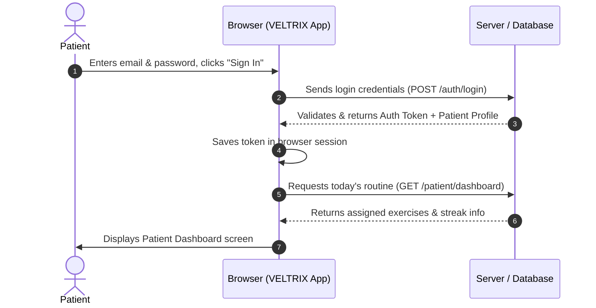
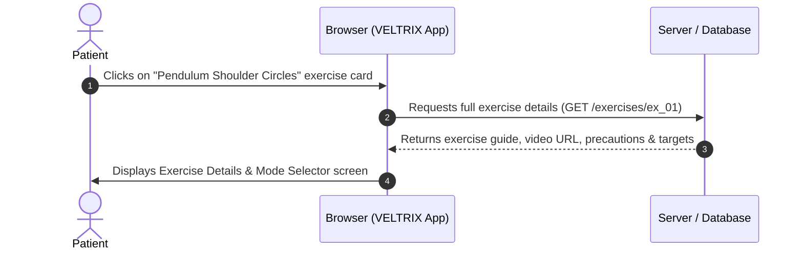
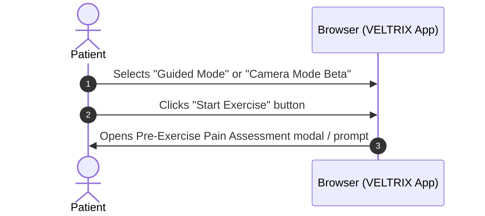
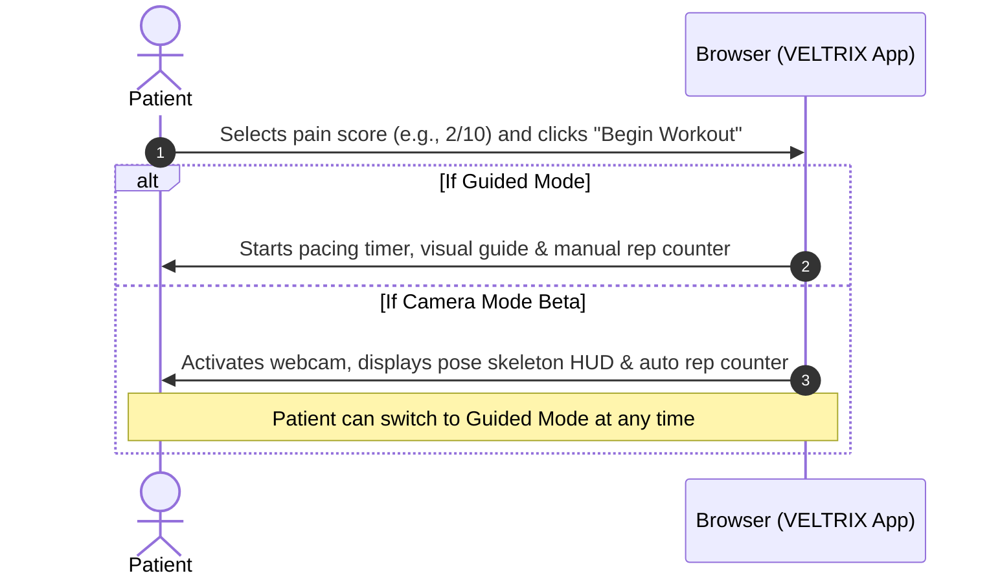
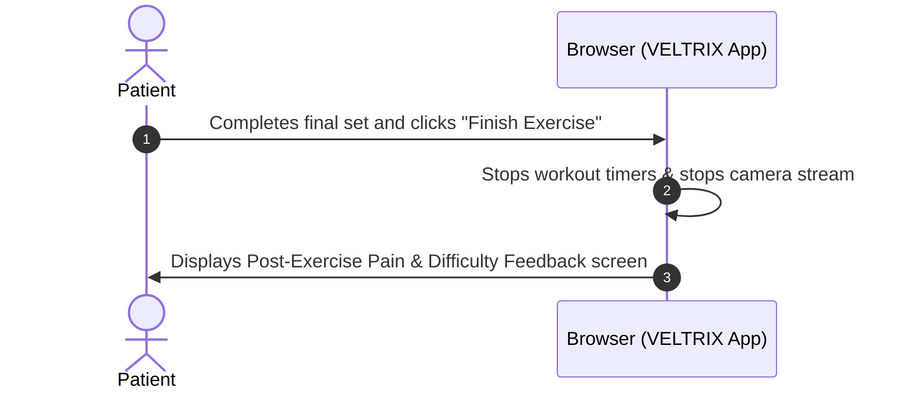
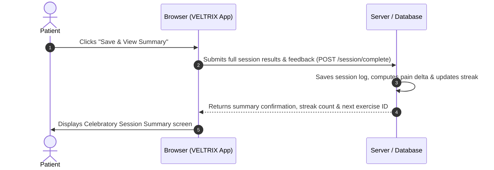
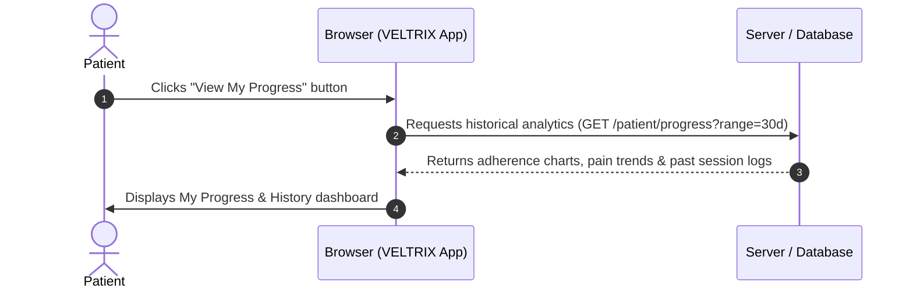

# VELTRIX: Complete Patient Journey & Interaction Flow

> **VELTRIX**: **V**itality + **E**levation + **T**racking + **IX** (Intelligent Experience)  
> **System**: AI-Assisted Rehabilitation and Care Management Web Application  
> **Document Type**: Step-by-Step Patient User Flow & State Transition Guide  
> **Document Status**: Complete Planning Reference  

---

## 1. Flow Overview & Architecture

This document breaks down the full journey a patient takes when using VELTRIX, explaining every screen, every button click, and how data moves between the user interface and the backend server in simple, clear language.

```mermaid
flowchart TD
    Step1["Step 1: Login / Register"] -->|Click 'Sign In' or 'Create Account'| Step2["Step 2: Patient Dashboard"]
    Step2 -->|Click on an Exercise Card| Step3["Step 3: Exercise Details"]
    Step3 -->|Select 'Guided' or 'Camera Beta' + Click 'Start Exercise'| Step4["Step 4: Pre-Exercise Pain Check"]
    Step4 -->|Select Initial Pain (0-10) + Click 'Begin Workout'| Step5["Step 5: Active Exercise Session"]
    Step5 -->|Complete all sets + Click 'Finish Exercise'| Step6["Step 6: Post-Exercise Pain & Difficulty"]
    Step6 -->|Submit ratings + Click 'Save & View Summary'| Step7["Step 7: Session Summary"]
    Step7 -->|Click 'View My Progress'| Step8["Step 8: My Progress & History"]
    Step7 -->|Click 'Next Exercise' or 'Back to Dashboard'| Step2
    Step8 -->|Click 'Dashboard' in navigation| Step2
```

---

## 2. Step-by-Step Transition Breakdown

---

### Step 1 $\rightarrow$ Step 2: Login / Register to Patient Dashboard



#### 1. Button / Action Triggered
- The patient types their credentials and clicks the **`[Sign In]`** button (or fills the registration form and clicks **`[Create Account]`**).

#### 2. What Screen Opens
- **Screen**: Patient Dashboard (`/dashboard`)

#### 3. What the Patient Sees on the New Screen
- A friendly personalized welcome header (e.g., *"Welcome back, Sarah! Today is Day 5 of your Shoulder Recovery"*).
- **Streak & Consistency Badge**: (e.g., *"🔥 4-Day Streak"*).
- **Today's Assigned Exercises List**: Cards showing each exercise for today, how many sets and reps are prescribed, whether it is pending or completed, and an estimated duration.
- **Therapist Note Card**: A quick reminder from their doctor or physiotherapist (e.g., *"Remember to keep movements slow and controlled"*).
- **Navigation Bar**: Quick links to *Dashboard*, *My Progress*, and *Logout*.

#### 4. Data Sent to the Backend (Egress)
```json
// Sent when clicking [Sign In]
{
  "email": "sarah.patient@example.com",
  "password": "SecurePassword123"
}
```

#### 5. Data Received from the Backend (Ingress)
```json
// 1. Received from login authentication:
{
  "token": "jwt_token_sample_abc123",
  "user": {
    "id": "pat_101",
    "name": "Sarah Miller",
    "therapist_name": "Dr. Johnson"
  }
}

// 2. Received when loading the dashboard:
{
  "program_name": "Rotator Cuff Rehab - Phase 2",
  "current_streak_days": 4,
  "weekly_adherence_percent": 80,
  "today_exercises": [
    {
      "id": "ex_01",
      "name": "Pendulum Shoulder Circles",
      "target_sets": 3,
      "target_reps": 10,
      "status": "pending",
      "camera_mode_available": true
    },
    {
      "id": "ex_02",
      "name": "Wall Crawl Finger Walk",
      "target_sets": 3,
      "target_reps": 8,
      "status": "pending",
      "camera_mode_available": false
    }
  ],
  "therapist_note": "Focus on smooth movement without rushing."
}
```

---

### Step 2 $\rightarrow$ Step 3: Patient Dashboard to Exercise Details



#### 1. Button / Action Triggered
- The patient clicks on any exercise card (e.g., **`[Pendulum Shoulder Circles]`**) or clicks **`[Start Next Exercise]`**.

#### 2. What Screen Opens
- **Screen**: Exercise Details & Mode Selector (`/exercises/:exerciseId`)

#### 3. What the Patient Sees on the New Screen
- **Exercise Header & Video Demonstration**: A high-definition looping clip or animation showing how to perform the movement correctly.
- **Target Prescription Box**:
  - Target Sets: `3 Sets`
  - Target Reps: `10 Reps per set`
  - Rest Duration: `45 Seconds between sets`
- **Step-by-Step Instructions**: Clear numbered text instructions on setup, movement, and return phase.
- **Precautions & Safety Advice**: Warning highlights (e.g., *"Do not let your back curve; keep your torso relaxed"*).
- **Mode Selection Cards**:
  1. **Guided Mode (Recommended)**: Reliable audio-visual pacing, step timer, and manual tap-to-count rep button. No camera required.
  2. **Camera Mode Beta (Optional AI)**: Uses your webcam to automatically count repetitions and show joint posture.

#### 4. Data Sent to the Backend (Egress)
- Request URL parameter containing the exercise ID: `GET /exercises/ex_01`.

#### 5. Data Received from the Backend (Ingress)
```json
{
  "exercise_id": "ex_01",
  "title": "Pendulum Shoulder Circles",
  "category": "Mobility & Range of Motion",
  "target_muscles": ["Deltoid", "Supraspinatus", "Rotator Cuff"],
  "video_url": "https://media.veltrix.app/videos/pendulum_stretch.mp4",
  "instructions": [
    "Lean forward slightly and support yourself with your non-injured arm on a table.",
    "Let your injured arm dangle straight down like a pendulum.",
    "Gently swing your arm in small, smooth clockwise circles."
  ],
  "precautions": [
    "Do not swing with aggressive force.",
    "Stop immediately if you feel sharp pain."
  ],
  "target_sets": 3,
  "target_reps": 10,
  "rest_seconds": 45,
  "camera_mode_available": true
}
```

---

### Step 3 $\rightarrow$ Step 4: Choose Mode to Pre-Exercise Pain Check



#### 1. Button / Action Triggered
- The patient clicks the radio card for their chosen mode (**`[Guided Mode]`** or **`[Camera Mode Beta]`**), then clicks the primary **`[Start Exercise]`** button.

#### 2. What Screen / Modal Opens
- **Screen / Modal**: Pre-Exercise Safety & Pain Check (`/session/:id/pre-check`)

#### 3. What the Patient Sees on the New Screen
- **Safety Prompt**: *"Before we begin, how is your pain right now?"*
- **0–10 Visual Pain Rating Scale**:
  - `0`: No Pain (Green smiling face)
  - `1–3`: Mild Ache (Yellow)
  - `4–6`: Moderate Pain (Orange)
  - `7–10`: Severe Pain (Red alert)
- **Helpful Context Text**: Helps the system measure if the exercise causes or relieves discomfort.
- **Action Button**: `[Begin Workout]` button.

#### 4. Data Sent to the Backend (Egress)
- No server request is required yet; the initial pain value is stored in the browser's temporary session state. (Or an optional session initialize ping: `POST /session/start` with `{ exercise_id: "ex_01", mode: "guided", pre_pain: 2 }`).

#### 5. Data Received from the Backend (Ingress)
- Not applicable (client-side state preparation).

---

### Step 4 $\rightarrow$ Step 5: Pre-Check to Active Exercise Session



#### 1. Button / Action Triggered
- The patient selects their current pain rating (e.g., `2 / 10`) and clicks **`[Begin Workout]`**.

#### 2. What Screen Opens
- **Screen**: Live Exercise Session (`/session/:id`)

#### 3. What the Patient Sees on the New Screen

##### When in Guided Mode (Standard):
- **Header**: Current Set (e.g., *Set 1 of 3*), Elapsed Time clock.
- **Exercise Demonstration Guide**: A rhythmic visualizer guiding the speed of movement (*"Lift... Hold... Lower..."*).
- **Rep Counter**: Big, readable counter (e.g., `Rep 0 / 10`).
- **Interactive Control Buttons**:
  - **`[+1 Rep]` / `[Tap to Count Rep]`**: Patient taps as they complete each circle.
  - **`[Complete Set]`**: Advances to rest timer when target reps are reached.
  - **`[Pause / Resume]`**: Temporarily stops the workout timer.
  - **`[Exit / End Early]`**: Safety escape button to stop if pain spikes.
- **Automatic Rest Timer (Between Sets)**:
  - When a set is completed, a 45-second rest countdown appears with a `[Skip Rest]` button.

##### When in Camera Mode Beta (Optional):
- **Live Video Box**: Displays the patient's webcam feed with a joint skeletal wireframe overlay.
- **Automatic HUD Counter**: Counts reps automatically when full range of motion is detected.
- **Joint Angle Arc**: Shows real-time angle feedback (e.g., *Arm Angle: 45°*).
- **Fail-Safe Switch**: A clear **`[Switch to Guided Mode]`** button is always present. If camera tracking is glitchy or lighting is poor, clicking this switches back to Guided Mode instantly without losing recorded progress.

#### 4. Data Sent to the Backend (Egress)
- Real-time rep ticks can be buffered locally in browser memory so the app never freezes or lags during the workout.

#### 5. Data Received from the Backend (Ingress)
- None required during active exercise (runs smoothly on the client device).

---

### Step 5 $\rightarrow$ Step 6: Exercise Session to Post-Exercise Pain & Difficulty



#### 1. Button / Action Triggered
- Once all sets are finished (or if the user clicks **`[Finish Exercise]`**), the active session ends.

#### 2. What Screen Opens
- **Screen**: Pain & Difficulty Rating (`/session/:id/feedback`)

#### 3. What the Patient Sees on the New Screen
- **Header**: *"Workout Complete! How do you feel right now?"*
- **Post-Exercise Pain Rating (0–10 VAS Scale)**:
  - Interactive slider or number buttons from `0` (No pain) to `10` (Unbearable pain).
- **Pain Sensation Tags (Optional)**:
  - Clickable pills: `Dull Ache`, `Sharp Pain`, `Stiffness`, `Muscle Fatigue`, `No Discomfort`.
- **Exercise Difficulty Rating (Borg RPE Scale 1–5)**:
  - `1 = Very Easy`, `2 = Easy`, `3 = Moderate`, `4 = Hard`, `5 = Too Strenuous`.
- **Notes for Therapist (Optional)**:
  - Text box for comments (e.g., *"Felt mild clicking during set 2"*).
- **Safety Banner**: If the user marks pain $\ge 7$, a warning advises them to rest and notes that their therapist will be notified.
- **Submit Action**: Primary **`[Save & View Summary]`** button.

#### 4. Data Sent to the Backend (Egress)
- Stored locally on form until user clicks submit.

#### 5. Data Received from the Backend (Ingress)
- Previous baseline pain for reference.

---

### Step 6 $\rightarrow$ Step 7: Feedback Submission to Session Summary



#### 1. Button / Action Triggered
- The patient clicks the **`[Save & View Summary]`** button.

#### 2. What Screen Opens
- **Screen**: Session Summary (`/session/:id/summary`)

#### 3. What the Patient Sees on the New Screen
- **Celebration Banner**: *"Great Job, Sarah!"* with achievement badge.
- **Performance Highlights**:
  - **Volume Done**: `3 of 3 Sets` (30 Reps completed - 100% Target Met).
  - **Total Active Time**: `6 Minutes 12 Seconds`.
  - **Mode Used**: `Guided Mode`.
- **Pain Comparison Card ($\Delta$)**:
  - Shows `Pre-Workout: 2/10` $\rightarrow$ `Post-Workout: 2/10` (*"Pain level stayed stable"*).
- **Streak & Consistency Status**:
  - *"🔥 5-Day Streak Maintained!"*
- **Sync Confirmation**:
  - *"✅ Results successfully sent to Dr. Johnson's clinical dashboard."*
- **Next Steps Buttons**:
  - **`[Next Assigned Exercise]`**: If more exercises remain today.
  - **`[Back to Dashboard]`**: Return to today's overview.
  - **`[View My Progress]`**: Go to the long-term analytics page.

#### 4. Data Sent to the Backend (Egress)
```json
// Sent to POST /session/complete
{
  "exercise_id": "ex_01",
  "mode_used": "guided",
  "completed_sets": 3,
  "completed_reps": 30,
  "total_duration_seconds": 372,
  "pre_pain_score": 2,
  "post_pain_score": 2,
  "pain_sensation_tags": ["mild_fatigue"],
  "difficulty_rating": 3,
  "patient_notes": "Felt good, slight fatigue on last 3 reps."
}
```

#### 5. Data Received from the Backend (Ingress)
```json
// Response from POST /session/complete
{
  "status": "success",
  "session_id": "sess_9876",
  "updated_streak_days": 5,
  "weekly_completion_rate": 85,
  "all_today_completed": false,
  "next_exercise": {
    "id": "ex_02",
    "name": "Wall Crawl Finger Walk"
  }
}
```

---

### Step 7 $\rightarrow$ Step 8: Session Summary to My Progress & History



#### 1. Button / Action Triggered
- The patient clicks **`[View My Progress]`** (or clicks "Progress" in the main navigation menu).

#### 2. What Screen Opens
- **Screen**: My Progress & History (`/progress`)

#### 3. What the Patient Sees on the New Screen
- **Time Range Filter Buttons**: `[This Week]` • `[Last 30 Days]` • `[Last 3 Months]` • `[All Time]`.
- **Adherence & Consistency Calendar**: Visual colored calendar or bar graph showing days exercises were completed vs. missed.
- **Pain Trend Line Chart**: A graph showing how pre-exercise and post-exercise pain scores have changed over the weeks, demonstrating recovery progress.
- **Cumulative Milestones**:
  - Total Exercises Completed: `42`
  - Total Repetitions: `1,260 Reps`
  - Total Active Minutes: `215 Minutes`
- **Past Session History Table**:
  - A scrollable list of completed sessions with Date, Exercise Name, Mode used, Reps completed, Pain Before/After, and a **`[View Details]`** button.

#### 4. Data Sent to the Backend (Egress)
- Request URL with filter query parameters: `GET /patient/progress?range=30d&exercise=all`.

#### 5. Data Received from the Backend (Ingress)
```json
{
  "summary": {
    "total_sessions": 42,
    "total_reps": 1260,
    "total_minutes": 215,
    "current_streak": 5,
    "longest_streak": 12
  },
  "pain_history": [
    { "date": "2026-08-20", "pre_pain": 6, "post_pain": 5 },
    { "date": "2026-08-24", "pre_pain": 4, "post_pain": 3 },
    { "date": "2026-08-28", "pre_pain": 2, "post_pain": 2 }
  ],
  "session_logs": [
    {
      "session_id": "sess_9876",
      "date": "2026-08-28",
      "exercise_name": "Pendulum Shoulder Circles",
      "mode": "guided",
      "sets_done": 3,
      "reps_done": 30,
      "pre_pain": 2,
      "post_pain": 2,
      "difficulty": 3
    }
  ]
}
```

---

## 3. Summary Transition Matrix

| From Screen | Trigger / Button | To Screen | Key Data Sent | Key Data Received |
| :--- | :--- | :--- | :--- | :--- |
| **Login / Register** | `[Sign In]` / `[Register]` | **Dashboard** | `email`, `password` | Auth Token, User Profile, Today's Routine |
| **Dashboard** | `[Exercise Card]` | **Exercise Details** | Exercise ID | Exercise instructions, target sets/reps, video URL |
| **Exercise Details** | `[Start Exercise]` | **Pre-Pain Check** | Mode selection (`guided` / `camera_beta`) | None (modal opens) |
| **Pre-Pain Check** | `[Begin Workout]` | **Active Session** | Baseline Pain (0–10) | None (session starts locally) |
| **Active Session** | `[Finish Exercise]` | **Post-Pain & Difficulty** | None | None (timers stop) |
| **Post-Pain & Difficulty**| `[Save & View Summary]` | **Session Summary** | Post-pain, difficulty rating, reps done, notes | Updated streak, next exercise ID |
| **Session Summary** | `[View My Progress]` | **My Progress** | Filter time range (`30d`) | Historical pain chart data, past workout logs |
| **Session Summary** | `[Next Exercise]` | **Exercise Details** | Next Exercise ID | Next exercise details & targets |

---
*Document prepared for the VELTRIX development and design team.*
