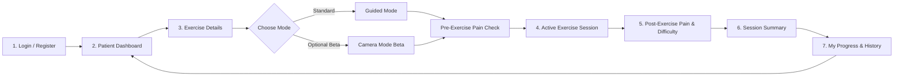

# VELTRIX: Patient Requirements & Screen Specification

> **VELTRIX**: **V**itality + **E**levation + **T**racking + **IX** (Intelligent Experience)  
> **System**: AI-Assisted Rehabilitation and Care Management Web Application  
> **Document Type**: Patient-Side Functional Requirements & Interaction Specification  
> **Document Status**: Draft / Planning Stage  

---

## 1. Executive Overview & Core Philosophy

VELTRIX empowers patients undergoing physical therapy and motor rehabilitation to execute prescribed exercise regimens safely, consistently, and accurately from home. 

### 1.1 Core Principles
- **Clarity & Accessibility**: Rehabilitation patients may have limited mobility, fatigue, or cognitive load; UI must be high-contrast, uncluttered, and readable with large touch targets.
- **Safety First & Pain Awareness**: Active tracking of pain levels before and after exercise ensures clinical safety and prevents overexertion.
- **Guided Mode as the Standard**: Step-by-step audiovisual guidance, rep/set timers, and visual demonstrations form the robust core foundation for every user and exercise.
- **Camera Mode Beta as an Optional Enhancement**: Pose detection and automated repetition counting provide an intelligent experience for eligible exercises, but are strictly **optional** with zero blocking dependencies on core session completion.

---

## 2. End-to-End Patient Journey

---

## 3. Detailed Screen Specifications

---

### Screen 1: Login / Registration Screen (`/login` & `/register`)

#### 1. Purpose
Authenticate existing patients securely, allow new patients to onboard with clinic/therapist assignment codes or credentials, and provide session persistence.

#### 2. What the Patient Sees
- **Brand Header**: VELTRIX logo, tagline, and clean minimalist aesthetic.
- **Toggle Tabs**: Seamless toggle between "Sign In" and "Create Account".
- **Form Card**:
  - **Login View**: Email/Username input, Password input, "Remember Me" checkbox, "Forgot Password?" link.
  - **Register View**: Full Name, Email, Password, Confirm Password, Optional Clinic/Therapist Invitation Code.
- **Validation Alerts**: Inline contextual warnings (e.g., password criteria, invalid email format, invalid invitation code).
- **Secondary Actions**: Support link for patients experiencing login difficulty.

#### 3. Data Displayed
- Application version and status.
- Inline form validation messages (e.g., "Password must be at least 8 characters").
- Error messages returned from server (e.g., "Invalid credentials", "Account locked").

#### 4. Interactive Actions & Buttons
- `[Switch to Sign Up / Sign In]`: Toggles active view.
- `[Toggle Password Visibility]`: Shows/hides masked password text.
- `[Sign In]`: Submits authentication credentials.
- `[Create Account]`: Submits registration details.
- `[Forgot Password?]`: Opens password recovery modal/workflow.
- `[Need Help?]`: Contact support / clinical helpline.

#### 5. Button Click & Event Behaviors
- **Click `[Sign In]`**:
  - Client validates non-empty email and password.
  - Button switches to loading state with spinner.
  - Dispatches authentication request to backend.
  - On success: Saves auth token (JWT/session cookie), redirects patient to `/dashboard`.
  - On failure: Displays clear error alert ("Incorrect email or password").
- **Click `[Create Account]`**:
  - Client validates field rules (email format, matching passwords).
  - On success: Sends registration payload, creates profile, logs user in, redirects to `/dashboard` or welcome onboarding.

#### 6. Information from Backend (Data Ingress)
- Auth token and session validity status.
- Basic user profile info (name, role `patient`, assigned therapist ID).
- Error responses (status codes 400/401/409 with descriptive message).

#### 7. Information Sent to Backend (Data Egress)
- **Login Payload**:
  - `email`: string
  - `password`: string
- **Registration Payload**:
  - `full_name`: string
  - `email`: string
  - `password`: string
  - `invitation_code`: string (optional)

---

### Screen 2: Patient Dashboard (`/dashboard`)

#### 1. Purpose
Serve as the central home hub for the patient to view today's rehabilitation schedule, current recovery streak, assigned exercises, and quick access to start therapy.

#### 2. What the Patient Sees
- **Welcome Header**: Personalized greeting (e.g., *"Good morning, Sarah"*), current date, and primary recovery goal (e.g., *"Rotator Cuff Rehabilitation - Week 3"*).
- **Quick Metric Cards**:
  - **Today's Completion**: e.g., "2 of 4 Exercises Completed" (Circular progress indicator).
  - **Streak & Consistency**: Current consecutive days streak (e.g., "🔥 5 Day Streak").
  - **Overall Weekly Adherence**: Percentage of assigned sessions completed this week.
- **Today's Assigned Exercises List**:
  - Cards for each exercise containing: Exercise thumbnail, title (e.g., *Pendulum Stretch*), target sets/reps (e.g., *3 sets × 10 reps*), estimated duration (e.g., *5 mins*), status badge (`Pending`, `In Progress`, `Completed`), and available mode tags (`Guided`, `Camera Beta`).
- **Upcoming / Next Session CTA**: Prominent "Start Next Exercise" button directly launching the next pending exercise.
- **Therapist Note Card**: Brief motivational note or clinical instruction from their assigned physiotherapist (e.g., *"Focus on slow descent today"*).
- **Navigation Bar**: Quick links to Dashboard, My Progress, Profile/Settings, and Logout.

#### 3. Data Displayed
- Patient's full name, assigned program title, and phase.
- List of prescribed exercises for the current calendar date.
- Target volume per exercise (target sets, reps, holds).
- Completion statuses for each item.
- Streak count, weekly adherence score.
- Latest therapist message snippet.

#### 4. Interactive Actions & Buttons
- `[Start Routine / Start Next Exercise]`: Direct action to begin the first incomplete exercise.
- `[Exercise Card Click]`: Navigates to `/exercises/:id` for full instructions.
- `[Quick Start Guided]`: Direct launch into Guided Mode for a specific card.
- `[Filter / View by Status]`: Toggle between "All", "Pending", and "Completed".
- `[View Full Progress]`: Redirects to `/progress`.

#### 5. Button Click & Event Behaviors
- **Click on Exercise Card or `[Details]`**: Navigates to `/exercises/:exerciseId` to inspect requirements and mode selection.
- **Click `[Start Routine]`**: Automatically selects the next uncompleted exercise and opens its Exercise Details page.
- **Click `[Mark as Rest Day / Need Help]`**: Triggers a prompt to log reason (e.g., severe pain, sickness) or contact clinic.

#### 6. Information from Backend (Data Ingress)
- Patient profile summary (name, avatar, assigned therapist name).
- Active treatment plan & prescription details:
  - Plan name, phase, start date, target duration.
- Today's prescribed exercise list:
  - `exercise_id`, `name`, `target_sets`, `target_reps`, `hold_duration_sec`, `thumbnail_url`, `completion_status`, `is_camera_supported`.
- Adherence metrics:
  - `current_streak_days`, `weekly_compliance_percentage`, `completed_today_count`, `total_today_count`.
- Therapist feedback / notes.

#### 7. Information Sent to Backend (Data Egress)
- Read receipts / dashboard access telemetry (optional).
- Filter / calendar date selector queries (e.g., requesting exercises for a past date).

---

### Screen 3: Exercise Details & Mode Selection (`/exercises/:id`)

#### 1. Purpose
Educate the patient on proper form, equipment required, precautions, and set/rep targets before beginning, and provide a clear choice between **Guided Mode** and **Camera Mode Beta**.

#### 2. What the Patient Sees
- **Top Navigation**: "Back to Dashboard" link, exercise title, and target muscle group tags (e.g., *Shoulder*, *Deltoid*, *Rotator Cuff*).
- **Demonstration Media Panel**: High-definition instructional loop video or animated demonstration showing proper biomechanical form.
- **Prescription Target Summary Box**:
  - Target Sets (e.g., *3 Sets*)
  - Target Repetitions (e.g., *10 Reps per set*)
  - Rest Duration between sets (e.g., *45 seconds*)
  - Hold Duration (e.g., *5 seconds hold* if static stretch)
- **Step-by-Step Instructions**: Numbered breakdown of setup, execution phase, and recovery phase.
- **Safety & Precautions Box**: Warning notes (e.g., *"Do not elevate arm past 90 degrees if sharp pain occurs"*).
- **Mode Selection Cards**:
  1. **Guided Mode (Standard & Recommended)**:
     - Icon & description: Audio-visual prompts, step-by-step rep guidance, manual rep checkoff, no webcam required.
     - Badge: `Standard / Reliable`.
  2. **Camera Mode Beta (Optional AI Tracking)**:
     - Icon & description: Real-time pose feedback via device camera, automatic rep detection, range-of-motion visualizer.
     - Badge: `Beta - Optional`.
     - System check indicator (e.g., Camera permission status / device compatibility warning).

#### 3. Data Displayed
- Full exercise metadata: name, category, difficulty rating, description, target anatomy.
- Media URLs (demo video, illustrations).
- Specific patient targets set by therapist (sets, reps, rest periods, resistance level).
- Special clinical warnings/notes customized for this patient.
- Camera mode compatibility flag (`available: true/false`).

#### 4. Interactive Actions & Buttons
- `[Back to Dashboard]`: Returns to main dashboard.
- `[Play/Pause Demo Video]`: Controls demonstration video playback.
- `[Select Guided Mode]`: Radio/card selector choosing standard mode.
- `[Select Camera Mode Beta]`: Radio/card selector choosing camera mode (disabled if unsupported).
- `[Start Exercise]`: Primary action button that moves the user to Pre-Exercise Pain Assessment.

#### 5. Button Click & Event Behaviors
- **Click Mode Card**: Highlights chosen mode and displays relevant prerequisites (e.g., choosing Camera Mode displays "Ensure good lighting and step back 2 meters").
- **Click `[Start Exercise]`**:
  - Validates chosen mode.
  - If Camera Mode chosen: Checks browser webcam permissions. If permission denied, seamlessly falls back to Guided Mode with an informative toast message.
  - Launches the Pre-Exercise Pain Check modal or step before entering the live session.

#### 6. Information from Backend (Data Ingress)
- Complete exercise record:
  - `exercise_id`, `title`, `description`, `instruction_steps[]`, `precautions[]`, `video_url`, `target_muscles[]`.
- Patient-specific prescribed dosage:
  - `assigned_sets`, `assigned_reps`, `target_hold_sec`, `rest_duration_sec`, `therapist_custom_notes`.
- Feature flag / compatibility:
  - `camera_mode_eligible`: boolean.

#### 7. Information Sent to Backend (Data Egress)
- Session initialization event:
  - `exercise_id`: string
  - `selected_mode`: `"guided"` | `"camera_beta"`
  - `started_at`: timestamp

---

### Screen 4: Active Exercise Session (`/session/:id`)

#### 1. Purpose
Provide a focused, distraction-free environment for executing the exercise routine, tracking sets/reps, pacing rest intervals, and providing real-time guidance.

#### 2. What the Patient Sees

##### A. In Guided Mode (Default Core Experience)
- **Status Header**: Exercise title, Current Set indicator (e.g., *Set 2 of 3*), Total Elapsed Time.
- **Visual Demonstration Area**: Synchronized loop animation or pacing visualizer guiding the cadence (e.g., "Lift for 2s, Hold for 3s, Lower for 2s").
- **Repetition & Set Counter**:
  - Giant, high-visibility counter (e.g., `Rep 7 / 10`).
  - Active Set progress bar.
- **Audio Cue Toggle**: Voice cues / metronome beeps ("Up", "Hold", "Down", "Rest").
- **Rest Interval Screen (Triggered automatically between sets)**:
  - Rest countdown timer (e.g., `45s`, `44s`...).
  - Hydration / posture tips.
  - `[Skip Rest]` button.
- **Bottom Control Bar**:
  - `[Log Repetition (+1)]` / auto-pace toggle.
  - `[Complete Set]`.
  - `[Pause / Resume]`.
  - `[Switch to Camera Mode Beta]` (if supported).
  - `[End Session / Exit]`.

##### B. In Camera Mode Beta (Optional Vision-Assisted Experience)
- **Live Video Feed with Pose Overlay**: Patient's webcam stream with optional wireframe skeletal overlay.
- **Rep & Form Feedback HUD**:
  - Real-time Rep Counter (incremented automatically by pose detection).
  - Range of Motion (ROM) Arc / Angle Gauge (e.g., *Elbow Angle: 85°*).
  - Form Quality Indicator (e.g., *Green = Good alignment*, *Yellow = Lift elbow higher*).
- **Positioning & Lighting Warning Banner**: Instant prompts if patient leaves frame (e.g., *"Step back into frame"* or *"Lighting is too low"*).
- **Fallback Button**: Prominent `[Switch to Guided Mode]` button always visible to ensure zero frustration if camera fails or patient prefers manual tracking.
- **Bottom Control Bar**: `[Pause]`, `[Switch to Guided]`, `[End Session]`.

#### 3. Data Displayed
- Live Rep count, current set number, total target sets.
- Elapsed session duration timer.
- Dynamic pacing instructions ("Inhale / Exhale", "Hold").
- Rest timer countdown.
- (Camera Mode Beta): Joint angles, form feedback alerts, frame-rate/tracking stability indicator.

#### 4. Interactive Actions & Buttons
- `[+1 Rep]` / `[-1 Rep]`: Manual repetition adjustment.
- `[Complete Set]`: Advances to rest interval or next set.
- `[Pause / Resume]`: Halts timers and video feed.
- `[Skip Rest]`: Bypasses inter-set rest timer to start next set immediately.
- `[Audio Mute/Unmute]`: Toggles auditory guidance cues.
- `[Switch Mode]`: Toggles dynamically between Guided Mode and Camera Mode Beta.
- `[Abort / End Early]`: Opens confirmation modal to safely exit (with reason: e.g., pain, time constraint).
- `[Finish Exercise]`: Advances to Post-Exercise Assessment once all sets are completed.

#### 5. Button Click & Event Behaviors
- **Click `[+1 Rep]` / Pose Detector Triggers Rep**: Increments current rep count; when `target_reps` is reached, automatically triggers set completion.
- **Set Completion**:
  - Triggers pleasant sound chime.
  - Initiates Rest Period countdown screen.
  - Increments completed set count.
- **Click `[Switch to Guided Mode]` (from Camera Mode)**:
  - Immediately shuts down webcam stream to conserve resources.
  - Retains all logged reps/sets seamlessly in memory.
  - Renders Guided Mode interface without resetting session progress.
- **Click `[Finish Exercise]`**:
  - Stops timers.
  - Navigates immediately to **Screen 5: Pain & Difficulty Assessment**.

#### 6. Information from Backend (Data Ingress)
- Exercise configuration (target reps, sets, tempo, rest interval).
- (Optional Camera Mode) Exercise landmark model configuration / joint threshold parameters.

#### 7. Information Sent to Backend (Data Egress)
- Real-time telemetry (buffered or sent on completion):
  - `session_id`: string
  - `completed_sets`: integer
  - `completed_reps`: integer
  - `actual_duration_sec`: integer
  - `mode_used`: `"guided"` | `"camera_beta"` | `"hybrid"`
  - `camera_mode_telemetry` (optional): average form accuracy score, detected ROM angles.

---

### Screen 5: Pain & Difficulty Assessment (`/session/:id/feedback`)

#### 1. Purpose
Collect structured clinical feedback on the patient's subjective pain experience (pre vs. post) and perceived exertion, providing essential safety data for therapists to adjust prescriptions.

#### 2. What the Patient Sees
- **Step Header**: "How was your session?" - Patient Safety & Feedback.
- **Pain Level Tracking Component**:
  - **Pre-Exercise Pain Score**: (Captured before starting or reviewed here for comparison).
  - **Post-Exercise Pain Score (Visual Analog Scale / Numerical Rating Scale 0–10)**:
    - Interactive 0–10 slider / numbered button grid with expressive faces and color coding:
      - `0`: No Pain (Green)
      - `1–3`: Mild / Tolerable (Yellow-Green)
      - `4–6`: Moderate Pain (Orange)
      - `7–9`: Severe Pain (Red-Orange)
      - `10`: Worst Possible Pain (Deep Red)
  - **Pain Location Selector**: Interactive body map or dropdown (e.g., *Right Shoulder*, *Lower Back*, *No localized pain*).
  - **Pain Type Tags**: Checkboxes for sensation (e.g., *Sharp*, *Dull Ache*, *Burning*, *Stiff*, *Fatigue*).
- **Exercise Difficulty Rating (Borg RPE Scale 1–5 or 1–10)**:
  - "How difficult was this exercise?"
  - Options: `Very Easy`, `Easy`, `Moderate`, `Hard`, `Too Difficult / Straining`.
- **Qualitative Notes Field**: Optional multiline text input (*"Any notes for your therapist? e.g., Felt a click on rep 8"*).
- **Severe Pain Safety Alert**: If patient selects pain $\ge 7$, a warning banner appears offering clinical guidance (e.g., *"Rest, apply ice if prescribed, and your therapist will be notified"*).

#### 3. Data Displayed
- Previous baseline pain score (for reference).
- Interactive visual labels for pain ratings and difficulty scales.
- Safety recommendations if elevated pain is detected.

#### 4. Interactive Actions & Buttons
- `[Pain Slider (0-10)]`: Selects numerical pain level.
- `[Difficulty Rating Pills]`: Selects perceived exertion level.
- `[Pain Type Tag Pills]`: Multi-select toggle for pain sensations.
- `[Body Location Selector]`: Selects anatomical pain location.
- `[Submit Feedback & View Summary]`: Finalizes feedback and submits complete session data.
- `[Skip Optional Notes]`: Allows rapid submission if user is fatigued.

#### 5. Button Click & Event Behaviors
- **Selecting Pain Rating $\ge 7$**:
  - Triggers prompt: *"You indicated severe pain. Do you need immediate assistance or would you like to flag this directly for urgent therapist review?"*
  - Automatically flags session as high-pain event in submission payload.
- **Click `[Submit Feedback & View Summary]`**:
  - Validates required ratings (pain score and difficulty must be chosen).
  - Sends comprehensive session record to backend.
  - On success: Transitions to **Screen 6: Session Summary**.

#### 6. Information from Backend (Data Ingress)
- Patient's historical average pain for this exercise.
- Safety threshold configuration (e.g., threshold for notifying clinician).

#### 7. Information Sent to Backend (Data Egress)
- **Session Feedback Payload**:
  - `session_id`: string
  - `pre_pain_score`: integer (0–10)
  - `post_pain_score`: integer (0–10)
  - `pain_delta`: integer (`post_pain - pre_pain`)
  - `pain_location`: string
  - `pain_characteristics`: string[] (e.g., `["dull", "stiff"]`)
  - `perceived_difficulty`: integer (1–5)
  - `patient_notes`: string
  - `urgent_pain_flag`: boolean

---

### Screen 6: Session Summary (`/session/:id/summary`)

#### 1. Purpose
Celebrate session completion, provide immediate positive reinforcement, display performance statistics, show pain delta, and update the patient's recovery trajectory.

#### 2. What the Patient Sees
- **Celebratory Header**: "Great Work, [Name]!" with motivational badge and celebratory animation (confetti effect).
- **Key Performance Stat Cards**:
  - **Volume Completed**: e.g., `3 / 3 Sets` • `30 Total Reps` (100% Target Met).
  - **Session Duration**: e.g., `8 mins 45 secs`.
  - **Mode Utilized**: Badge indicating `Guided Mode` or `Camera Mode Beta`.
- **Pain & Comfort Delta Card**:
  - Visual comparison badge: Pre-Pain vs. Post-Pain (e.g., `Pre: 2/10` $\rightarrow$ `Post: 2/10` `[Stable Pain Level]`).
- **Streak & Milestones Unlocked**:
  - "🔥 5-Day Streak Maintained!"
  - "Progress towards weekly goal: 75% complete".
- **Therapist Visibility Indicator**:
  - Notice badge: *"✅ This session report has been synced to Dr. Johnson's clinical portal."*
- **Action Buttons**:
  - `[Next Assigned Exercise]` (if more exercises remain today).
  - `[Back to Dashboard]`.
  - `[View My Progress]`.

#### 3. Data Displayed
- Summary stats: sets completed, reps completed, elapsed active time, rest time.
- Pre vs. post pain change comparison.
- Updated streak number and updated weekly completion score.
- Number of remaining exercises for today.

#### 4. Interactive Actions & Buttons
- `[Continue to Next Exercise]`: Direct transition to the next uncompleted exercise.
- `[Return to Dashboard]`: Navigates to `/dashboard`.
- `[View Progress & Trends]`: Navigates to `/progress`.
- `[Share Achievement]` (optional): Generates summary card for personal records.

#### 5. Button Click & Event Behaviors
- **Click `[Continue to Next Exercise]`**:
  - Fetches next pending exercise ID from today's plan.
  - Redirects to `/exercises/:nextExerciseId`.
- **Click `[Return to Dashboard]`**:
  - Navigates to `/dashboard` with updated completion checkboxes.

#### 6. Information from Backend (Data Ingress)
- Processed session summary response:
  - `session_id`, `completed_at`, `total_reps`, `total_sets`, `compliance_rate`.
  - `updated_streak_days`: integer.
  - `weekly_progress_percentage`: float.
  - `next_pending_exercise_id`: string | null.

#### 7. Information Sent to Backend (Data Egress)
- Navigation and dismissal events.

---

### Screen 7: My Progress & History (`/progress`)

#### 1. Purpose
Provide patients with an empowering, long-term view of their rehabilitation recovery, adherence consistency, pain reduction trends, and historical session logs.

#### 2. What the Patient Sees
- **Time Range Selector**: Filter tabs for `This Week`, `Last 30 Days`, `Last 3 Months`, `All Time`.
- **Adherence & Consistency Chart**:
  - Interactive bar/calendar heatmap showing days completed vs. missed.
  - Overall adherence score (e.g., `92% Compliance`).
- **Pain Progression Curve (Clinical Trend)**:
  - Line graph plotting Pre-Pain and Post-Pain over time across weeks.
  - Demonstrates long-term reduction in baseline pain levels.
- **Volume & Repetition Milestones**:
  - Total reps performed (e.g., `1,240 Reps`), Total active therapy minutes (e.g., `340 mins`).
- **Historical Session Log List**:
  - Chronological list of completed sessions.
  - Each entry displays: Date, Exercise Name, Mode used (`Guided` / `Camera Beta`), Sets/Reps completed, Pain Rating (Pre/Post), and button to `[View Details]`.
- **Past Session Detail Modal**:
  - Full breakdown of sets, reps, recorded notes, and difficulty ratings for any past session.

#### 3. Data Displayed
- Aggregate stats (total sessions, total minutes, current streak, longest streak).
- Chart data points (dates, pain values, completion status).
- Paginated table/list of historical workout logs.

#### 4. Interactive Actions & Buttons
- `[Time Filter Tabs]`: Toggles 7D / 30D / 90D / All view.
- `[Exercise Filter Dropdown]`: Filters charts and history by specific exercise (e.g., *All Exercises*, *Shoulder Abduction*, *Knee Extension*).
- `[Session Row Click / View Details]`: Opens session breakdown modal.
- `[Download / Export Summary Report]`: Generates a patient summary (PDF/CSV) to share with physicians or insurance.
- `[Back to Dashboard]`: Returns to home view.

#### 5. Button Click & Event Behaviors
- **Click Time Filter**: Updates chart datasets dynamically with smooth transition.
- **Click Historical Session Row**: Opens modal displaying full timestamped metrics and therapist notes for that specific session.
- **Click Export**: Sends request to generate a structured progress report.

#### 6. Information from Backend (Data Ingress)
- Historical analytics dataset:
  - `daily_adherence[]`: `{ date, scheduled, completed }`
  - `pain_history[]`: `{ date, exercise_id, pre_pain, post_pain }`
  - `summary_metrics`: `{ total_sessions, total_reps, total_minutes, avg_pain_reduction }`
- Paginated session logs list:
  - `sessions[]`: `{ session_id, date, exercise_title, mode, sets_done, reps_done, pain_before, pain_after, difficulty }`

#### 7. Information Sent to Backend (Data Egress)
- Query parameters:
  - `time_range`: `"7d"` | `"30d"` | `"90d"` | `"all"`
  - `exercise_id`: string (optional filter)
  - `page`: integer
  - `page_size`: integer

---

## 4. Feature Matrix: Guided Mode vs. Camera Mode Beta

| Feature Aspect | Guided Mode (Standard) | Camera Mode Beta (Optional AI) |
| :--- | :--- | :--- |
| **Core Role** | Primary baseline for all patients and exercises | Experimental assistive tool for eligible exercises |
| **Hardware Required** | Any screen (Phone, Tablet, Laptop) | Device with functional webcam & good lighting |
| **Repetition Tracking** | Manual checkoff or timed automated cadence | Automated real-time pose landmark detection |
| **Feedback Mechanism** | Audio-visual pacing cues, tempo guides | Real-time joint angle arc, posture alerts |
| **Fallout / Error Recovery** | N/A (Always functional offline/online) | One-click instant fallback to Guided Mode |
| **Clinical Value** | Consistency, adherence, simplicity | Biomechanical form adherence, ROM insights |
| **Session Completion Dependency** | **100% Autonomous (Zero camera dependency)**| **Non-blocking (Optional progressive enhancement)**|

---

## 5. Global Navigation & State Management Rules

1. **Safety Interruption (Emergency / Pain Escape)**:
   - At any moment during active exercise, an "Exit Session" button must be within 1 tap.
   - If exited due to pain, the app immediately routes to Pain Feedback before saving partial progress.
2. **Session Persistence (Preventing Data Loss)**:
   - If the patient accidentally reloads the page or loses network connection during a session, client state (current set, completed reps, pre-exercise pain score) is preserved in `sessionStorage` or local state.
3. **Graceful Degradation**:
   - If Camera Mode Beta fails to initialize (permission denied, low FPS, unsupported WebGL/WASM), the UI must not crash or show raw errors; it must toast an empathetic message and switch immediately to Guided Mode.
4. **Therapist Data Synchronization**:
   - Every completed session with its pain score and difficulty rating is marked with an immutable sync status to confirm delivery to the therapist's clinical dashboard.

---

## 6. Summary of Data Exchanges (API Overview)

| Endpoint Purpose | Direction | Key Data Ingress / Egress |
| :--- | :--- | :--- |
| **Authentication** | Client $\leftrightarrow$ Backend | Credentials $\rightarrow$ Token, User Profile |
| **Dashboard Routine** | Backend $\rightarrow$ Client | Today's assigned exercises, prescription dosage, streak count |
| **Exercise Metadata** | Backend $\rightarrow$ Client | Exercise instructions, demo video, safety warnings, camera eligibility |
| **Session Start** | Client $\rightarrow$ Backend | `exercise_id`, `selected_mode`, `pre_pain_score`, `timestamp` |
| **Session Submission** | Client $\rightarrow$ Backend | `completed_sets`, `completed_reps`, `post_pain_score`, `difficulty`, `notes` |
| **Session Summary** | Backend $\rightarrow$ Client | Performance badge, updated streak, compliance score, next exercise ID |
| **Progress & History** | Backend $\rightarrow$ Client | Time-series pain trend, adherence calendar heatmap, past session logs |

---
*Document prepared for the VELTRIX Full-Stack Engineering & UX Team.*
