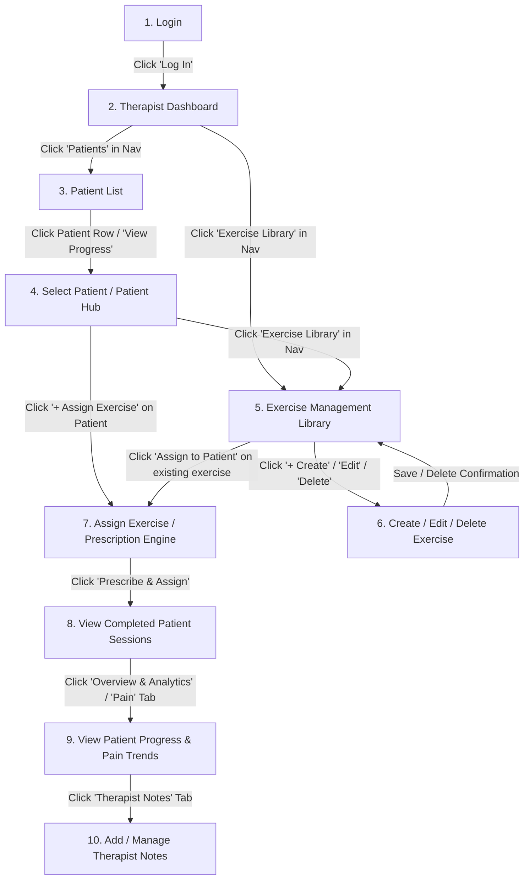

# VELTRIX — End-to-End Therapist Workflow & Journey Guide

## 1. Document Purpose & Scope

This document specifies the complete, sequential user journey of a physical therapist within the **VELTRIX Rehabilitation Platform**. It details every interaction step, screen transition, visual display state, inbound backend data payload, and outbound backend request across the entire clinical lifecycle.

---

## 2. End-to-End Journey Architecture



---

## 3. Step-by-Step Transition Specifications

---

### Step 1: Login & Session Authentication

#### 1. What the Therapist Clicks
- Enters email into the **Email** input field.
- Enters password into the **Password** input field.
- (Optional) Clicks **Remember Me** checkbox.
- Clicks the primary **"Log In"** button.

#### 2. What Screen Opens
- The **Therapist Dashboard** (`/therapist/dashboard`).

#### 3. What Information is Displayed
- *Pre-submission:* Clean login modal with input fields, security/HIPAA compliance badge, and password toggle.
- *During submission:* Form inputs disable, loading spinner renders on the "Log In" button.
- *On Transition:* Full therapist dashboard shell with top global navigation bar (`Dashboard`, `Patients`, `Exercise Library`), personalized clinician greeting banner, caseload KPI metric cards, high-priority clinical alerts, and recent completed session feeds.

#### 4. Data Eventually Coming from Backend
- **Response to Login (`POST /api/auth/therapist/login`):**
  ```json
  {
    "token": "eyJhbGciOiJIUzI1NiIsIn...",
    "therapist": {
      "id": "th_987654",
      "firstName": "Dr. Sarah",
      "lastName": "Jenkins",
      "email": "s.jenkins@rehabclinic.org",
      "role": "PHYSICAL_THERAPIST",
      "clinicName": "Metropolitan Orthopedic Rehab",
      "avatarUrl": "https://cdn.veltrix.io/avatars/th_987654.jpg"
    }
  }
  ```

#### 5. Data Eventually Sent to Backend
- **Login Submission (`POST /api/auth/therapist/login`):**
  ```json
  {
    "email": "s.jenkins@rehabclinic.org",
    "password": "SecurePassword123!",
    "rememberMe": true
  }
  ```

---

### Step 2: Therapist Dashboard & Caseload Triage

#### 1. What the Therapist Clicks
- Clicks the **"Patients"** link in the top navigation bar (or clicks **"View All Patients"** in the caseload footer).
- *(Note: The therapist can also click **"Exercise Library"** directly from the top navigation bar or quick actions to navigate straight to Step 5).*

#### 2. What Screen Opens
- The **Patient List** screen (`/therapist/patients`).

#### 3. What Information is Displayed
- **On Dashboard:**
  - KPI Cards: Total Active Patients (e.g., `24`), Average Caseload Adherence (e.g., `87%`), High Pain / Risk Alerts (e.g., `3`), Sessions Completed Today (e.g., `12`).
  - High-Priority Alert items (e.g., *"John Doe: Pain reported 8/10 on Knee Extension"*).
  - Recent completed session feed.
- **On Transition to Patient List:**
  - Breadcrumb: `Dashboard > Patients`.
  - Search bar and multidimensional filter pills (Status, Target Joint, Risk Level).
  - Tabular / Card view of all assigned patients with real-time adherence progress bars and color-coded pain indicators.

#### 4. Data Eventually Coming from Backend
- **Dashboard Summary Data (`GET /api/therapist/dashboard-summary`):**
  ```json
  {
    "summaryMetrics": {
      "activePatientsCount": 24,
      "overallAdherencePercentage": 87.5,
      "criticalAlertsCount": 3,
      "todayCompletedSessionsCount": 12
    },
    "criticalAlerts": [
      {
        "alertId": "alt_101",
        "patientId": "pt_404",
        "patientName": "John Doe",
        "alertType": "HIGH_PAIN",
        "severity": "HIGH",
        "description": "Reported 8/10 pain during Straight Leg Raise",
        "timestamp": "2026-08-28T14:30:00Z"
      }
    ]
  }
  ```

#### 5. Data Eventually Sent to Backend
- **Dashboard Fetch Request:** `GET /api/therapist/dashboard-summary` (Bearer Token in headers).

---

### Step 3: Patient List Exploration & Search

#### 1. What the Therapist Clicks
- (Optional) Types `"John Doe"` into search or applies filters (e.g., selects `Knee` joint filter or `Active` status).
- Clicks on the **Patient Row** or clicks the primary **"View Progress"** action button next to the desired patient.

#### 2. What Screen Opens
- The **Patient Clinical Profile & Progress Hub** (`/therapist/patients/:patientId/progress`).

#### 3. What Information is Displayed
- **On Patient List:**
  - Full table of patients showing Name, Demographics, Primary Diagnosis, Active Protocol, Weekly Adherence %, Last Reported Pain (0–10), and Last Activity timestamp.
- **On Transition to Patient Hub:**
  - Patient Context Header banner: Name, DOB, Age, Injured Joint, Surgery Date, Care Phase, and Contact Info.
  - Active Prescriptions summary card list.
  - Primary navigation tabs: `Overview & Analytics`, `Session History & Telemetry`, `Pain History`, `Therapist Notes`.

#### 4. Data Eventually Coming from Backend
- **Patient Directory Query (`GET /api/therapist/patients`):**
  ```json
  {
    "totalCount": 24,
    "page": 1,
    "pageSize": 10,
    "patients": [
      {
        "patientId": "pt_404",
        "firstName": "John",
        "lastName": "Doe",
        "dateOfBirth": "1988-04-12",
        "gender": "Male",
        "primaryDiagnosis": "Post-Op ACL Reconstruction (Right Knee)",
        "targetJoint": "Right Knee",
        "adherenceRate": 85.0,
        "lastPainScore": 3,
        "lastSessionDate": "2026-08-28T09:15:00Z",
        "clinicalStatus": "ACTIVE"
      }
    ]
  }
  ```

#### 5. Data Eventually Sent to Backend
- **Search & Filter Query:**
  - `GET /api/therapist/patients?search=John&targetJoint=Knee&status=ACTIVE&page=1&pageSize=10`

---

### Step 4: Patient Selection & Clinical Review

#### 1. What the Therapist Clicks
- Reviews John Doe's active recovery status, ROM trajectory, and current prescribed regimen.
- Clicks the **"Exercise Library"** link in the top global navigation bar (to browse/manage available exercises in the clinic catalog).
- *(Note: If the therapist already knows what to prescribe, they can click the **"+ Assign Exercise"** button in the patient header to jump straight to Step 7).*

#### 2. What Screen Opens
- The **Exercise Management Library** (`/therapist/exercises`).

#### 3. What Information is Displayed
- Global Exercise Library catalog grid categorized by target joint (`Knee`, `Shoulder`, `Spine`, `Ankle`, `Hip`) and movement type.
- Header controls: Search library, category filter pills, difficulty filters, and **"+ Create New Exercise"** action button.
- Exercise cards displaying title, video preview thumbnail, target joint badge, default sets/reps/hold parameters, and action controls (`View`, `Edit`, `Assign to Patient`, `Delete`).

#### 4. Data Eventually Coming from Backend
- **Patient Detail Overview (`GET /api/therapist/patients/pt_404`):**
  ```json
  {
    "patientId": "pt_404",
    "fullName": "John Doe",
    "injuryDetails": "Right Knee ACL tear, Hamstring Autograft",
    "surgeryDate": "2026-07-15",
    "currentPhase": "Phase 2: Early Strengthening & ROM",
    "assignedTherapist": "Dr. Sarah Jenkins"
  }
  ```

#### 5. Data Eventually Sent to Backend
- **Fetch Patient Profile:** `GET /api/therapist/patients/pt_404`

---

### Step 5: Exercise Management Library Browsing

#### 1. What the Therapist Clicks
- *Access routes:* Can be reached at any time via the **top global navigation bar**, the **dashboard quick actions**, or during patient plan evaluation.
- Clicks an exercise card to open detailed view, or clicks **"+ Create New Exercise"** in the header, or clicks the **Edit** / **Delete** icons on a specific exercise card (initiating Step 6).
- *(Alternatively, clicks **"Assign to Patient"** on an existing exercise card to initiate Step 7).*

#### 2. What Screen Opens
- If viewing details: **Exercise Details Modal / Drawer**.
- If clicking "+ Create New Exercise": **Create Exercise Modal**.
- If clicking "Edit": **Edit Exercise Modal** pre-populated with current parameters.
- If clicking "Delete": **Delete Confirmation Dialog**.

#### 3. What Information is Displayed
- **Exercise Catalog:** Grid of all standard library and clinic-custom exercises with thumbnails, target joints, movement categories, difficulty tags, and action buttons.
- **Exercise Details Modal:** Demonstration video loop, anatomical focus, step-by-step patient execution instructions, AI pose tracking checkpoints, contraindications, and default sets/reps/hold metrics.

#### 4. Data Eventually Coming from Backend
- **Exercise Catalog Response (`GET /api/therapist/exercises`):**
  ```json
  {
    "exercises": [
      {
        "exerciseId": "ex_201",
        "name": "Seated Knee Extension with Quad Hold",
        "category": "Strength & ROM",
        "targetJoint": "Knee",
        "difficulty": "BEGINNER",
        "thumbnailUrl": "https://cdn.veltrix.io/thumbs/ex_201.jpg",
        "videoUrl": "https://cdn.veltrix.io/videos/ex_201.mp4",
        "defaultSets": 3,
        "defaultReps": 10,
        "defaultHoldSeconds": 5,
        "targetRomAngle": 90,
        "isCustom": false
      }
    ]
  }
  ```

#### 5. Data Eventually Sent to Backend
- **Catalog Filter Request:** `GET /api/therapist/exercises?targetJoint=Knee&category=Strength`

---

### Step 6: Create, Edit & Delete Exercise (Library Management)

#### 1. What the Therapist Clicks
- **For Create:** Fills in Exercise Title, Target Joint, Movement Type, Difficulty, Instructions, Video URL / media file, sets default parameters (e.g., `3 sets`, `12 reps`, `3s hold`), and clicks **"Save Exercise"**.
- **For Edit:** Adjusts instructions, target angles, or default parameters for an existing exercise, and clicks **"Save Changes"**.
- **For Delete:** Clicks the trash can icon on a custom exercise, then clicks **"Confirm Delete"** in the confirmation modal.
- *(Key behavior: Creating, editing, or deleting an exercise does NOT force patient assignment. It is a self-contained library management operation).*

#### 2. What Screen Opens
- The modal/dialog closes with a success toast notification (*"Exercise successfully created / updated / deleted"*).
- The therapist **returns directly to the Exercise Management Library (`/therapist/exercises`)**.

#### 3. What Information is Displayed
- Updated Exercise Library catalog showing the newly created or updated exercise card in the grid (or removed if deleted).
- Confirmation toast message.
- Full library search and filter controls remain active.

#### 4. Data Eventually Coming from Backend
- **On Create Success (`POST /api/therapist/exercises`):**
  ```json
  {
    "success": true,
    "exerciseId": "ex_999",
    "message": "Custom exercise created successfully",
    "exercise": {
      "exerciseId": "ex_999",
      "name": "Terminal Knee Extension with Band",
      "targetJoint": "Knee",
      "category": "Strength",
      "difficulty": "INTERMEDIATE",
      "defaultSets": 3,
      "defaultReps": 12,
      "defaultHoldSeconds": 3,
      "isCustom": true
    }
  }
  ```
- **On Update Success (`PUT /api/therapist/exercises/:exerciseId`):**
  ```json
  {
    "success": true,
    "message": "Exercise updated successfully"
  }
  ```
- **On Delete Success (`DELETE /api/therapist/exercises/:exerciseId`):**
  ```json
  {
    "success": true,
    "message": "Exercise archived successfully"
  }
  ```

#### 5. Data Eventually Sent to Backend
- **Create Exercise Payload (`POST /api/therapist/exercises`):**
  ```json
  {
    "name": "Terminal Knee Extension with Band",
    "category": "Strength",
    "targetJoint": "Knee",
    "movementType": "Resistance Extension",
    "difficulty": "INTERMEDIATE",
    "description": "Terminal knee extension against resistance band to isolate VMO.",
    "instructions": [
      "Secure band behind knee crease.",
      "Step back until band is taut.",
      "Contract quadriceps to fully straighten knee against resistance.",
      "Hold for 3 seconds, then slowly return."
    ],
    "defaultSets": 3,
    "defaultReps": 12,
    "defaultHoldSeconds": 3,
    "targetRomAngle": 0
  }
  ```
- **Update Exercise Payload (`PUT /api/therapist/exercises/ex_999`):**
  ```json
  {
    "name": "Terminal Knee Extension with Band (Updated)",
    "defaultSets": 3,
    "defaultReps": 15,
    "defaultHoldSeconds": 5
  }
  ```
- **Delete Exercise Request (`DELETE /api/therapist/exercises/ex_999`):** Path parameter `exerciseId`.

---

### Step 7: Assign Exercise / Prescription Engine

#### 1. What the Therapist Clicks
- *Triggering assignment (separate flow using existing exercise):*
  - **Option A (From Library):** Clicks **"Assign to Patient"** on an existing exercise card (e.g., *"Seated Knee Extension with Quad Hold"*).
  - **Option B (From Patient Hub):** Clicks **"+ Assign Exercise"** in John Doe's profile header, then selects an existing exercise from the picker.
- Configures personalized prescription parameters:
  - Selects Patient: `"John Doe"` (if not already set).
  - Sets: `3`
  - Reps: `12`
  - Hold Duration: `5` seconds
  - Daily Frequency: `2x daily`
  - Schedule: `Mon, Tue, Wed, Thu, Fri`
  - Target ROM Angle: `0° to 90°`
  - Rest Between Sets: `45s`
  - Therapist Form Instructions: *"Focus on full quad lock at peak extension. Do not hike your hip."*
- Clicks the primary **"Prescribe & Assign"** button.

#### 2. What Screen Opens
- Navigates directly to **Patient Progress & Session Details** (`/therapist/patients/pt_404/progress`), automatically highlighting the newly assigned protocol and focusing on the **Session History & Telemetry** tab.

#### 3. What Information is Displayed
- Green confirmation alert: *"Prescription successfully assigned to John Doe."*
- Updated active prescription regimen card list showing the assigned exercise, target parameters, and scheduled days.
- Completed session history feed ready for clinical review.

#### 4. Data Eventually Coming from Backend
- **Prescription Creation Response (`POST /api/therapist/prescriptions`):**
  ```json
  {
    "prescriptionId": "rx_5501",
    "patientId": "pt_404",
    "status": "ACTIVE",
    "assignedAt": "2026-08-28T14:45:00Z",
    "exerciseCount": 1
  }
  ```

#### 5. Data Eventually Sent to Backend
- **Prescription Submission Payload (`POST /api/therapist/prescriptions`):**
  ```json
  {
    "patientId": "pt_404",
    "prescriptions": [
      {
        "exerciseId": "ex_201",
        "sets": 3,
        "reps": 12,
        "holdDurationSeconds": 5,
        "restBetweenSetsSeconds": 45,
        "frequencyPerDay": 2,
        "scheduledDaysOfWeek": ["MON", "TUE", "WED", "THU", "FRI"],
        "targetRomAngleMin": 0,
        "targetRomAngleMax": 90,
        "startDate": "2026-08-29",
        "endDate": "2026-09-26",
        "therapistInstructions": "Focus on full quad lock at peak extension. Do not hike your hip."
      }
    ]
  }
  ```

---

### Step 8: View Patient Completed Exercise Sessions

#### 1. What the Therapist Clicks
- Therapist clicks on a specific session row in the **Completed Sessions Table** (e.g., Session dated *"Today, 09:15 AM - Seated Knee Extension"*).
- (Optional) Toggles the **"Flag Session for Follow-up"** button if form deviations were severe.

#### 2. What Screen Opens
- Expands the **Session Deep-Dive & Telemetry Inspector** panel on the same screen.

#### 3. What Information is Displayed
- **Session Overview:** Execution timestamp, duration (e.g., `8m 32s`), completed sets/reps (`3 sets x 10 reps`), and overall AI form score (`92%`).
- **AI Posture & Pose Tracking Breakdown:**
  - Repetition-by-repetition accuracy chart.
  - Joint angle curve per rep showing peak extension angle (e.g., `88°`).
  - Compensation detection badges (e.g., *"Mild trunk leaning on Rep 9 & 10"*).
  - AI automated feedback summary.
- **Patient Self-Reported Session Feedback:** Pain score reported at end of session (`3/10`) and patient note (*"Felt a bit tight on set 3"*).

#### 4. Data Eventually Coming from Backend
- **Session Telemetry Data (`GET /api/therapist/patients/pt_404/sessions/sess_789`):**
  ```json
  {
    "sessionId": "sess_789",
    "patientId": "pt_404",
    "exerciseName": "Seated Knee Extension",
    "completedAt": "2026-08-28T09:15:00Z",
    "durationSeconds": 512,
    "completedSets": 3,
    "completedReps": 10,
    "overallAccuracyScore": 92.0,
    "maxRomReached": 88.5,
    "reportedPainScore": 3,
    "repTelemetry": [
      {
        "repNumber": 1,
        "romAngle": 90.0,
        "durationSeconds": 4.8,
        "compensationFlags": []
      },
      {
        "repNumber": 9,
        "romAngle": 84.0,
        "durationSeconds": 5.1,
        "compensationFlags": ["TRUNK_LEAN_BACKWARD"]
      }
    ],
    "aiSummaryFeedback": "Excellent quad activation and extension control. Minor trunk compensation detected on final repetitions due to fatigue."
  }
  ```

#### 5. Data Eventually Sent to Backend
- **Fetch Session Telemetry:** `GET /api/therapist/patients/pt_404/sessions/sess_789`
- **Optional Flag Request (`PUT /api/therapist/sessions/sess_789/flag`):** `{ "flagged": true, "reason": "Fatigue compensation review" }`

---

### Step 9: View Patient Progress & Pain Trends

#### 1. What the Therapist Clicks
- Clicks the **"Overview & Analytics"** or **"Pain History"** tab in the patient sub-navigation bar.
- Changes date range filter (e.g., selects **"Last 4 Weeks"**).

#### 2. What Screen Opens
- Switches view to the **Longitudinal Progress Analytics & Pain Tracking Dashboard**.

#### 3. What Information is Displayed
- **Range of Motion (ROM) Recovery Curve:** Multi-week graph plotting peak knee extension and flexion angle vs. healthy benchmark (0° extension, 135° flexion).
- **Adherence & Compliance Graph:** Bar chart comparing prescribed sessions vs actual completed sessions per week.
- **Pain History (VAS 0–10) Trendline:**
  - Line graph showing pain scores over time correlated with exercise milestones.
  - Highlighted color zones (Green: 0–3, Yellow: 4–6, Red: 7–10).
  - Detailed pain log table with date, associated exercise, score, and patient description.

#### 4. Data Eventually Coming from Backend
- **Patient Analytics & Pain History Payload (`GET /api/therapist/patients/pt_404/analytics`):**
  ```json
  {
    "adherencePercentage": 88.2,
    "romTrends": [
      { "date": "2026-08-01", "kneeExtensionAngle": 72.0, "targetAngle": 90.0 },
      { "date": "2026-08-14", "kneeExtensionAngle": 81.0, "targetAngle": 90.0 },
      { "date": "2026-08-28", "kneeExtensionAngle": 88.5, "targetAngle": 90.0 }
    ],
    "painLogs": [
      {
        "date": "2026-08-28T09:15:00Z",
        "painScore": 3,
        "exercise": "Seated Knee Extension",
        "comment": "Slight tightness, no sharp pain"
      },
      {
        "date": "2026-08-25T16:00:00Z",
        "painScore": 5,
        "exercise": "Heel Slide",
        "comment": "Felt joint stiffness"
      }
    ]
  }
  ```

#### 5. Data Eventually Sent to Backend
- **Analytics Fetch Query:** `GET /api/therapist/patients/pt_404/analytics?timeframe=4_weeks`

---

### Step 10: Add & Manage Therapist Notes

#### 1. What the Therapist Clicks
- Clicks the **"Therapist Notes"** tab in the patient profile body.
- Clicks into the **Add Clinical Note** text area.
- Selects Note Type from dropdown: `"Plan Modification"` (or `"General Progress"`, `"Assessment"`, `"Check-in"`).
- (Optional) Checks `"Share with Patient"` toggle.
- Types clinical observations and therapeutic plan adjustments.
- Clicks the primary **"Save Clinical Note"** button.

#### 2. What Screen Opens
- Updates the active **Therapist Notes Timeline** in real time on the same screen.

#### 3. What Information is Displayed
- Text editor clears and shows ready state for next entry.
- The newly submitted note immediately appears at the top of the chronological notes feed with:
  - Therapist name and credential badge (`Dr. Sarah Jenkins, PT, DPT`).
  - Formatted timestamp (`Aug 28, 2026, 2:50 PM`).
  - Category pill badge (`Plan Modification`).
  - Patient visibility icon (`Visible to Patient` or `Internal Only`).
  - Full note text.
  - Action options: `Edit` and `Delete`.

#### 4. Data Eventually Coming from Backend
- **Create Note Response (`POST /api/therapist/patients/pt_404/notes`):**
  ```json
  {
    "noteId": "nt_8801",
    "patientId": "pt_404",
    "authorId": "th_987654",
    "authorName": "Dr. Sarah Jenkins",
    "authorRole": "PHYSICAL_THERAPIST",
    "noteType": "PLAN_MODIFICATION",
    "isPatientVisible": true,
    "content": "Patient demonstrating excellent extension recovery (88.5° ROM). Increased knee extension prescription to 3x12 with 5s hold. Emphasized avoidance of trunk compensation when fatigued.",
    "createdAt": "2026-08-28T14:50:22Z",
    "updatedAt": "2026-08-28T14:50:22Z"
  }
  ```

#### 5. Data Eventually Sent to Backend
- **Create Note Submission Payload (`POST /api/therapist/patients/pt_404/notes`):**
  ```json
  {
    "noteType": "PLAN_MODIFICATION",
    "isPatientVisible": true,
    "content": "Patient demonstrating excellent extension recovery (88.5° ROM). Increased knee extension prescription to 3x12 with 5s hold. Emphasized avoidance of trunk compensation when fatigued."
  }
  ```

---

## 4. End-to-End Journey Data Contract Summary

| Step # | Journey Phase | User Action Trigger | Frontend Request | Key Inbound Backend Payload |
|---|---|---|---|---|
| **1** | **Login** | Clicks "Log In" | `POST /api/auth/therapist/login` | Bearer Token & Clinician Profile |
| **2** | **Dashboard** | Navigates to Dashboard / Nav Links | `GET /api/therapist/dashboard-summary` | Caseload stats, pain/adherence alerts, recent sessions |
| **3** | **Patient List** | Clicks "Patients" in Nav | `GET /api/therapist/patients` | Paginated directory of assigned patients |
| **4** | **Select Patient** | Clicks Patient Row | `GET /api/therapist/patients/:id` | Full medical profile, diagnosis, care phase |
| **5** | **Exercise Library** | Clicks "Exercise Library" in Nav / Dashboard | `GET /api/therapist/exercises` | Categorized catalog of standard and custom exercises |
| **6** | **Exercise CRUD** | Clicks "Save Exercise" / "Confirm Delete" | `POST / PUT / DELETE /api/therapist/exercises` | Persisted exercise confirmation & returns to Library |
| **7** | **Assign Exercise** | Clicks "Assign to Patient" on existing exercise | `POST /api/therapist/prescriptions` | Active prescription bundle confirmation |
| **8** | **View Sessions** | Clicks Completed Session | `GET /api/therapist/patients/:id/sessions/:sessionId` | Rep breakdown, AI pose metrics, form accuracy % |
| **9** | **View Progress** | Clicks "Analytics / Pain" | `GET /api/therapist/patients/:id/analytics` | Multi-week ROM curves, compliance %, pain history logs |
| **10** | **Add Notes** | Clicks "Save Note" | `POST /api/therapist/patients/:id/notes` | Persisted clinical note with timestamp & author |

---

## 5. Summary & Document Validation

- **Specification Status:** Finalized Therapist Flow & Journey Model
- **Target Platform:** VELTRIX Web Application
- **Conformance:** Covers all 10 transitions sequentially with UI triggers, display views, decoupled exercise management CRUD, global library accessibility, and backend request/response payloads without application or API code.
