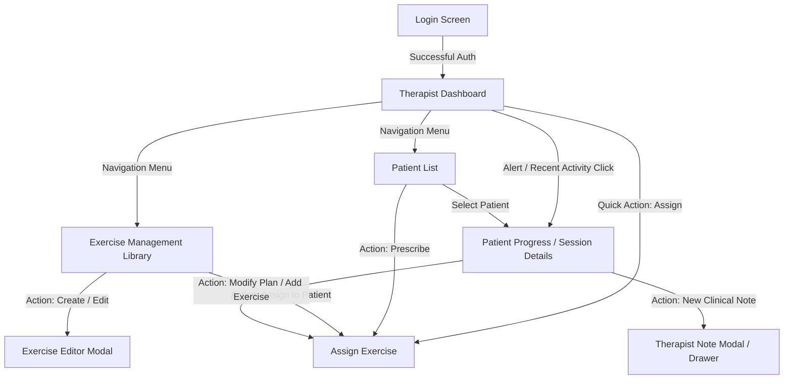

# VELTRIX — Therapist Requirements Specification

## 1. Document Overview & Scope

### 1.1 Purpose
This document specifies the end-to-end functional requirements, user interface flows, and data interaction contracts for the **Therapist Portal** of the **VELTRIX AI-Assisted Rehabilitation and Care Management Platform**. 

This document serves as the planning baseline for UX/UI designers, frontend engineers, backend engineers, and QA teams. It strictly covers system behaviors, screen states, button actions, and frontend-backend data payloads without embedding implementation code.

---

### 1.2 Core Therapist Capabilities Checklist

| # | Capability | Description | Primary Screen(s) |
|---|---|---|---|
| 1 | **Login** | Secure authentication and session initiation for clinical staff | Login Screen |
| 2 | **View Therapist Dashboard** | High-level clinical overview of active caseload, alerts, and recent patient activity | Dashboard |
| 3 | **View Patients** | Filterable, searchable directory of all assigned patients | Patient List |
| 4 | **View Patient Details** | Comprehensive clinical profile, demographics, injury context, and assigned plan | Patient Progress / Details |
| 5 | **Create Exercises** | Author new rehabilitation exercises with target joints, media, and default parameters | Exercise Management |
| 6 | **Read / View Exercises** | Browse and inspect exercise library with motion instructions and guidelines | Exercise Management |
| 7 | **Update Exercises** | Modify metadata, instructions, difficulty levels, and motion parameters of existing exercises | Exercise Management |
| 8 | **Delete Exercises** | Archive or remove deprecated exercises from the library | Exercise Management |
| 9 | **Assign Exercises to Patients** | Prescribe personalized regimens (sets, reps, hold duration, frequency, target ROM) | Assign Exercise |
| 10 | **View Completed Exercise Sessions** | Inspect historical session telemetry, completion rates, and AI posture feedback | Patient Progress / Session Details |
| 11 | **View Patient Progress** | Track longitudinal recovery curves, range-of-motion (ROM) metrics, and adherence rates | Patient Progress / Session Details |
| 12 | **View Pain History** | Review subjective pain score logs (VAS/NRS 0–10) correlated with specific sessions | Patient Progress / Session Details |
| 13 | **Add Therapist Notes** | Record clinical observations, feedback, and rehabilitation plan adjustments | Patient Progress / Session Details |

---

## 2. Navigation Architecture & Screen Hierarchy

---

## 3. Detailed Screen Specifications

---

### Screen 1: Login

#### 1. Screen Objective
Authenticate licensed physical therapists, athletic trainers, and clinical personnel, establishing a secure role-scoped session.

#### 2. What the Therapist Sees
- **Brand Header:** VELTRIX logo, application name, and clinician portal tagline.
- **Login Form Card:**
  - Email / Username input field with clear label and placeholder (`clinician@hospital.org`).
  - Password input field with toggleable show/hide password icon.
  - "Remember Me" checkbox.
  - "Forgot Password?" clickable recovery link.
- **Action Area:** Primary "Log In" submission button.
- **Security & Compliance Notice:** HIPAA / Data privacy confidentiality badge.
- **Error / Notice Banner:** Conditional banner displayed upon invalid credentials or locked account states.

#### 3. Buttons & Interactive Elements
| Element | Type | Location | Initial State |
|---|---|---|---|
| `Show/Hide Password` | Icon Button | Inside password input | Active (Eye icon, default masked) |
| `Remember Me` | Checkbox | Below input fields | Unchecked |
| `Forgot Password?` | Text Link | Adjacent to "Remember Me" | Enabled |
| `Log In` | Primary Button | Bottom of form card | Enabled |

#### 4. Button Behaviors & User Flows
- **Click `Show/Hide Password`:** Toggles the password field masking between plaintext and asterisks.
- **Click `Forgot Password?`:** Navigates the therapist to the password reset request screen.
- **Click `Log In`:**
  - *Frontend Validation:* Checks if email format is valid and password field is non-empty. If invalid, displays inline field error messages ("Please enter a valid email address").
  - *Submission State:* Disables `Log In` button, displays a loading spinner inside the button.
  - *Success:* Backend authenticates therapist, issues authentication token/session cookie, stores therapist profile in application state, and redirects the therapist to `/therapist/dashboard`.
  - *Failure (Invalid Credentials / Locked Account):* Displays an error banner at top of card ("Invalid email or password. Please try again."). Re-enables button.

#### 5. Information Coming from Backend
- **On Initial Load:** CSRF token (if applicable), system status / maintenance banner (if any).
- **On Successful Auth Response:**
  - `token`: Bearer JWT token or HTTP-only session cookie.
  - `therapist`:
    - `id`: Unique therapist identifier.
    - `firstName`, `lastName`: Clinician's display name.
    - `email`: Clinician's email.
    - `role`: Role indicator (e.g., `THERAPIST`, `LEAD_CLINICIAN`).
    - `clinicId`, `clinicName`: Affiliated facility / department name.
    - `avatarUrl`: Profile image URL.

#### 6. Information Sent to Backend
- **Login Request Payload (`POST /api/auth/therapist/login`):**
  - `email`: String (trimmed, lowercased).
  - `password`: String (plaintext over TLS).
  - `rememberMe`: Boolean.

---

### Screen 2: Therapist Dashboard

#### 2.1 Screen Objective
Provide a real-time clinical command center summarizing caseload adherence, high-risk pain alerts, upcoming sessions, and rapid access to core workflows.

#### 2.2 What the Therapist Sees
- **Top Navigation Bar:**
  - VELTRIX Logo.
  - Global navigation links: `Dashboard`, `Patients`, `Exercise Library`.
  - Global Search bar (searches patients and exercises).
  - Notifications Bell icon with unread badge counter.
  - Therapist Profile menu (name, clinic, avatar, logout).
- **Welcome & Date Banner:** Personalized greeting (e.g., *"Good morning, Dr. Sarah. You have 3 patients requiring attention today."*) and current date.
- **Key Metrics KPI Summary Cards:**
  - *Total Active Patients:* Total count of assigned active cases.
  - *Weekly Adherence Rate:* Percentage of prescribed exercises completed across caseload.
  - *Pain / Risk Alerts:* Count of unreviewed sessions reporting high pain (> 6/10) or significant ROM regression.
  - *Completed Sessions Today:* Number of patient-completed rehab sessions today.
- **High-Priority Alerts & Clinical Flag Section:**
  - List of critical alerts: Patient name, flagged issue (e.g., "Reported Pain Level 8/10 on Knee Extension", "Missed 3 consecutive days"), timestamp, and quick "Review" button.
- **Recent Completed Sessions Feed:**
  - Table or card list showing the latest 5–10 completed patient sessions with: Patient name, exercise name, completion score (AI posture accuracy %), reported pain score, and completion timestamp.
- **Quick Action Bar:**
  - `+ Assign New Exercise` button.
  - `+ Create Exercise` button.
  - `+ Add New Patient` (or invite) button.

#### 2.3 Buttons & Interactive Elements
| Element | Type | Location | Initial State |
|---|---|---|---|
| `Global Search` | Search Input | Top Navigation Bar | Empty |
| `Notification Bell` | Icon Button | Top Navigation Bar | Enabled (with badge) |
| `Profile Dropdown / Logout` | Dropdown Menu | Top Navigation Bar | Collapsed |
| `Metric Card Click` | Interactive Card | KPI Summary Section | Enabled (Filters view) |
| `Review Alert` | Secondary Button | High-Priority Alerts card | Enabled |
| `View Session Details` | Table Row / Button | Recent Sessions Feed | Enabled |
| `+ Assign New Exercise` | Primary Action Button | Quick Actions Header | Enabled |
| `+ Create Exercise` | Secondary Action Button | Quick Actions Header | Enabled |
| `View All Patients` | Link Button | Section Footer | Enabled |

#### 2.4 Button Behaviors & User Flows
- **Click `Profile Dropdown -> Logout`:** Clears auth tokens/session, clears cached state, and redirects to `Login`.
- **Click `Review Alert`:** Navigates directly to the specific patient's `Patient Progress / Session Details` screen, pre-scrolled to the flagged session.
- **Click `View Session Details`:** Navigates to `Patient Progress / Session Details` screen with that specific session selected.
- **Click `+ Assign New Exercise`:** Opens the `Assign Exercise` screen with an empty patient selection prompt.
- **Click `+ Create Exercise`:** Navigates to `Exercise Management` and immediately opens the `Create Exercise Modal`.
- **Click `View All Patients`:** Navigates to the `Patient List` screen.

#### 2.5 Information Coming from Backend
- **Dashboard Aggregate Payload (`GET /api/therapist/dashboard-summary`):**
  - `summaryMetrics`:
    - `activePatientsCount`: Number.
    - `overallAdherencePercentage`: Number (0–100).
    - `criticalAlertsCount`: Number.
    - `todayCompletedSessionsCount`: Number.
  - `criticalAlerts`: Array of objects:
    - `alertId`: Unique alert ID.
    - `patientId`: Patient ID.
    - `patientName`: Full name.
    - `alertType`: (`HIGH_PAIN`, `NON_COMPLIANCE`, `ROM_REGRESSION`).
    - `severity`: (`HIGH`, `MEDIUM`).
    - `description`: Human-readable summary.
    - `timestamp`: ISO timestamp.
  - `recentSessions`: Array of objects:
    - `sessionId`: Unique session ID.
    - `patientId`: Patient ID.
    - `patientName`: Full name.
    - `exerciseName`: Name of exercise performed.
    - `accuracyScore`: Number (0–100%).
    - `painScore`: Number (0–10).
    - `completedAt`: ISO timestamp.
    - `hasTherapistReviewed`: Boolean.

#### 2.6 Information Sent to Backend
- **Initial Load Request:** `GET /api/therapist/dashboard-summary` with therapist auth token.
- **Dismiss/Acknowledge Alert Request:** `POST /api/therapist/alerts/:alertId/acknowledge` with `{ alertId: string }`.

---

### Screen 3: Patient List

#### 3.1 Screen Objective
Provide a filterable, searchable directory of all patients assigned to the therapist, enabling rapid lookup, risk triage, and navigation to individual clinical profiles.

#### 3.2 What the Therapist Sees
- **Page Header:** Screen title ("My Patients"), total patient count, and "+ Add / Invite Patient" button.
- **Search & Filter Controls Bar:**
  - Text search field (filters by patient name, email, medical record number, or primary diagnosis).
  - Status filter dropdown (`All`, `Active`, `On Hold`, `Discharged`).
  - Condition / Body Region filter (`All`, `Knee`, `Shoulder`, `Lumbar Spine`, `Hip`, `Cervical`).
  - Risk / Adherence filter (`All`, `High Risk (< 50% adherence)`, `Pain Flagged`, `On Track`).
  - Sort dropdown (`Last Active (Newest)`, `Name (A-Z)`, `Adherence (Low to High)`, `Pain (High to Low)`).
- **Patient Data Table / Card Grid (Toggleable):**
  - Columns:
    - **Patient Name & Avatar:** Full name, age, gender, thumbnail.
    - **Diagnosis & Target Joint:** e.g., "Post-Op ACL Reconstruction (Right Knee)".
    - **Treatment Plan:** Active plan name, prescribed exercises count.
    - **Adherence Rate:** Progress bar with percentage (e.g., `85%`).
    - **Latest Reported Pain:** Color-coded indicator (Green: 0–3, Yellow: 4–6, Red: 7–10).
    - **Last Activity Date:** Relative time (e.g., "2 hours ago", "3 days ago").
    - **Status Badge:** `Active`, `Attention Needed`, `Inactive`.
    - **Actions Column:** Quick action buttons.
- **Pagination / Infinite Scroll Bar:** Total pages, records per page selector (`10`, `25`, `50`), next/previous buttons.
- **Empty State View:** Friendly illustration and message when no patients match search/filter criteria.

#### 3.3 Buttons & Interactive Elements
| Element | Type | Location | Initial State |
|---|---|---|---|
| `Search Patients` | Search Input | Filter Bar | Empty |
| `Status Filter` | Dropdown | Filter Bar | Value: `Active` |
| `Body Region Filter`| Dropdown | Filter Bar | Value: `All` |
| `Sort By` | Dropdown | Filter Bar | Value: `Last Active` |
| `View Mode Toggle` | Toggle (Table / Grid) | Filter Bar | Table View selected |
| `Patient Row / Name Link`| Clickable Row | Data Table | Enabled |
| `Assign Exercise` | Secondary Action Button | Table Actions Column | Enabled |
| `View Progress` | Primary Action Button | Table Actions Column | Enabled |
| `Page Navigation (< / >)`| Pagination Buttons | Table Footer | Dependent on page count |

#### 3.4 Button Behaviors & User Flows
- **Search / Filter Alteration:** Debounced query triggers filtering without full page reload; updates table with matching records.
- **Click `Patient Row` or `View Progress`:** Navigates directly to `Patient Progress / Session Details` for the selected patient (`/therapist/patients/:patientId/progress`).
- **Click `Assign Exercise`:** Navigates directly to `Assign Exercise` screen with this patient pre-selected (`/therapist/patients/:patientId/assign-exercise`).
- **Click `Page Navigation`:** Requests next/previous page slice from backend.

#### 3.5 Information Coming from Backend
- **Patient List Response Payload (`GET /api/therapist/patients`):**
  - `totalCount`: Total matching records.
  - `page`: Current page number.
  - `pageSize`: Records per page.
  - `patients`: Array of patient summaries:
    - `patientId`: String.
    - `firstName`, `lastName`: Strings.
    - `avatarUrl`: String / null.
    - `dateOfBirth`: Date string (or calculated age).
    - `gender`: String.
    - `primaryDiagnosis`: String.
    - `targetJoint`: String.
    - `assignedExercisesCount`: Number.
    - `adherenceRate`: Number (0–100).
    - `lastPainScore`: Number (0–10) or null.
    - `lastSessionDate`: ISO timestamp or null.
    - `clinicalStatus`: (`ACTIVE`, `ATTENTION_NEEDED`, `ON_HOLD`, `DISCHARGED`).

#### 3.6 Information Sent to Backend
- **Query Parameters on Fetch:**
  - `GET /api/therapist/patients?page=1&pageSize=10&search=john&status=ACTIVE&targetJoint=Knee&sort=lastActive_desc`
  - Headers: `Authorization: Bearer <token>`.

---

### Screen 4: Exercise Management (Library & CRUD)

#### 4.1 Screen Objective
Empower therapists to curate the clinical exercise catalog: create new exercises, review instructions and reference media, update movement parameters, and deprecate/delete obsolete exercises.

#### 4.2 What the Therapist Sees
- **Page Header:** Title ("Exercise Management Library"), search bar, filter pills, and a prominent "+ Create New Exercise" button.
- **Filter & Category Sidebar / Header:**
  - Category / Body Area: (`All`, `Knee`, `Shoulder`, `Spine`, `Ankle & Foot`, `Hip`, `Wrist & Elbow`).
  - Movement Type: (`Range of Motion`, `Strength`, `Stretching`, `Balance / Neuromuscular`).
  - Difficulty Level: (`Beginner`, `Intermediate`, `Advanced`).
  - Author / Source filter: (`VELTRIX Standard Library`, `My Custom Exercises`, `Clinic Shared`).
- **Exercise Grid / Catalog Cards:**
  - Exercise thumbnail / video preview poster.
  - Exercise Name (e.g., "Seated Knee Extension with Quad Hold").
  - Target Joint & Movement Category badges.
  - Difficulty pill (`Beginner`, `Intermediate`, `Advanced`).
  - Default metrics summary (e.g., "Default: 3 Sets x 10 Reps | 5s Hold").
  - Custom / System Badge (distinguishes clinic-created vs platform-standard exercises).
  - Context menu / action icons: `View`, `Edit`, `Assign`, `Delete`.
- **Exercise Details Modal / Drawer (View Mode):**
  - Video player or animated demonstration loop.
  - Description, anatomical focus, and target muscles.
  - Step-by-step patient execution instructions.
  - Recommended posture checkpoints and AI pose tracking angle landmarks (e.g., "Monitors knee flexion/extension angle 0°–90°").
  - Contraindications and common compensation errors to avoid.
- **Exercise Create / Edit Modal Form:**
  - Form fields: Exercise Name, Category, Target Joint, Movement Type, Difficulty, Description, Step-by-step Instructions, Video/Media Upload or URL, Default Reps, Default Sets, Default Hold Duration (seconds), Target Angle / Range of Motion threshold.
- **Delete Confirmation Dialog:**
  - Warning modal: *"Are you sure you want to delete '[Exercise Name]'? Existing patient prescriptions will retain historical data, but this exercise cannot be newly assigned."*

#### 4.3 Buttons & Interactive Elements
| Element | Type | Location | Initial State |
|---|---|---|---|
| `+ Create New Exercise` | Primary Action Button | Header | Enabled |
| `Category Filter Pills` | Filter Pill Group | Filter Bar | `All` selected |
| `Search Library` | Search Input | Filter Bar | Empty |
| `Exercise Card Click / View`| Interactive Card / Icon | Exercise Card | Enabled |
| `Edit Exercise` | Secondary Action Icon | Exercise Card / Detail Modal | Enabled (Editable for custom/authorized exercises) |
| `Delete Exercise` | Danger Action Icon | Exercise Card / Detail Modal | Enabled (Protected for system templates) |
| `Assign to Patient` | Action Button | Exercise Card / Detail Modal | Enabled |
| `Save Exercise` | Primary Button | Create/Edit Modal | Enabled |
| `Cancel` | Secondary Button | Create/Edit Modal | Enabled |
| `Confirm Delete` | Danger Button | Delete Confirmation Modal | Enabled |

#### 4.4 Button Behaviors & User Flows
- **Click `+ Create New Exercise`:**
  - Opens empty `Create Exercise Modal`.
  - Therapist enters exercise attributes, sets default parameters, enters motion instructions, and attaches media.
- **Click `Save Exercise` (in Create/Edit Modal):**
  - *Validation:* Checks required fields (Name, Category, Instructions, Target Joint).
  - *Submission:* Sends payload to backend. Displays spinner.
  - *Success:* Closes modal, displays toast notification ("Exercise created/updated successfully"), and refreshes the library list.
- **Click `Edit Exercise`:**
  - Fetches complete exercise details from backend (if not preloaded), populates `Create/Edit Modal` with existing values, and sets modal title to "Edit Exercise".
- **Click `Delete Exercise`:**
  - Opens `Delete Confirmation Dialog`.
- **Click `Confirm Delete`:**
  - Sends delete/archive request to backend.
  - *Success:* Removes item from view, shows confirmation toast ("Exercise successfully deleted").
- **Click `Assign to Patient`:**
  - Navigates to `Assign Exercise` screen with this specific exercise pre-selected.

#### 4.5 Information Coming from Backend
- **Exercise Library Response (`GET /api/therapist/exercises`):**
  - `exercises`: Array of exercise objects:
    - `exerciseId`: Unique ID.
    - `name`: Exercise title.
    - `category`: Category name.
    - `targetJoint`: Body joint.
    - `movementType`: ROM / Strength / Stretch.
    - `difficulty`: (`BEGINNER`, `INTERMEDIATE`, `ADVANCED`).
    - `thumbnailUrl`: Image URL.
    - `videoUrl`: Video demonstration URL.
    - `description`: Text.
    - `instructions`: Array of string steps.
    - `contraindications`: Array of strings.
    - `defaultSets`: Number.
    - `defaultReps`: Number.
    - `defaultHoldSeconds`: Number.
    - `targetRomAngle`: Number (degrees) or null.
    - `isCustom`: Boolean.
    - `createdBy`: Clinician ID or 'SYSTEM'.
    - `createdAt`, `updatedAt`: ISO timestamps.

#### 4.6 Information Sent to Backend
- **Create Exercise Payload (`POST /api/therapist/exercises`):**
  - `name`: String (required).
  - `category`: String (required).
  - `targetJoint`: String (required).
  - `movementType`: String (required).
  - `difficulty`: String (`BEGINNER` | `INTERMEDIATE` | `ADVANCED`).
  - `description`: String.
  - `instructions`: Array of strings.
  - `contraindications`: Array of strings.
  - `videoUrl` or `mediaFile`: String / multipart.
  - `defaultSets`: Number.
  - `defaultReps`: Number.
  - `defaultHoldSeconds`: Number.
  - `targetRomAngle`: Number.
- **Update Exercise Payload (`PUT /api/therapist/exercises/:exerciseId`):**
  - Same fields as create payload, plus `exerciseId`.
- **Delete Exercise Request (`DELETE /api/therapist/exercises/:exerciseId`):**
  - Path parameter `exerciseId`.

---

### Screen 5: Assign Exercise

#### 5.1 Screen Objective
Enable therapists to configure and prescribe personalized exercise regimens to a specific patient, tailoring dosage, frequency, hold durations, range-of-motion targets, and personalized clinical guidance.

#### 5.2 What the Therapist Sees
- **Step 1: Patient Context Selector / Banner:**
  - If navigated from a patient's profile: Fixed patient summary card (Name, Age, Primary Diagnosis, Injured Side, Current Rehabilitation Phase).
  - If navigated globally: Patient selection searchable dropdown / autocomplete picker.
- **Step 2: Exercise Selection Panel:**
  - Searchable exercise picker with category and target joint filters.
  - Visual selector allowing the therapist to pick one or multiple exercises to add to the prescription batch.
  - Selected exercises summary list with drag-and-drop reordering for routine sequence.
- **Step 3: Prescription Parameter Customization Form (per selected exercise):**
  - **Sets:** Numeric stepper (e.g., `3` sets).
  - **Reps per Set:** Numeric stepper (e.g., `10` reps).
  - **Hold Duration:** Numeric input in seconds (e.g., `5` seconds hold at peak extension).
  - **Daily Frequency:** Dropdown (e.g., `1x daily`, `2x daily`, `Every other day`).
  - **Schedule / Days of Week:** Day picker pills (`M`, `T`, `W`, `T`, `F`, `S`, `S`).
  - **Target Range of Motion (ROM):** Min/Max target angle inputs in degrees (e.g., `Target Flexion: 90°`).
  - **Rest Period Between Sets:** Input in seconds (e.g., `45` seconds).
  - **Start Date & End Date / Duration:** Date pickers (e.g., "Active for 4 weeks").
  - **Therapist Special Instructions / Form Cues:** Multiline text area (e.g., *"Keep back straight; stop immediately if sharp pain occurs in anterior joint line."*).
- **Prescription Preview Summary Card:** Live summary showing total estimated daily routine time and weekly exercise load.
- **Action Footer:** "Cancel" button, "Save as Draft" button, and prominent "Prescribe / Assign Exercise" button.

#### 5.3 Buttons & Interactive Elements
| Element | Type | Location | Initial State |
|---|---|---|---|
| `Patient Select Dropdown` | Autocomplete Select | Patient Context Banner | Populated if accessed from patient |
| `Exercise Search & Select`| Multi-select / Catalog | Exercise Selection Area | Enabled |
| `Remove Selected Exercise`| Icon Button (`X`) | Selected Exercise Card | Enabled |
| `Sets / Reps Stepper (+/-)`| Numeric Stepper Buttons | Parameters Form | Preloaded with exercise defaults |
| `Days of Week Selector` | Toggle Buttons (Pills)| Parameters Form | Default: Mon-Fri selected |
| `Cancel` | Secondary Button | Action Footer | Enabled |
| `Save as Draft` | Secondary Button | Action Footer | Enabled |
| `Prescribe & Assign` | Primary Action Button | Action Footer | Enabled (Disabled if no exercise/patient selected) |

#### 5.4 Button Behaviors & User Flows
- **Select Patient (if not pre-selected):** Loads the patient's existing active regimen so the therapist can avoid duplicate prescriptions.
- **Select Exercise(s):** Adds the chosen exercise to the active assignment canvas and pre-populates parameter fields with the exercise's clinical default values.
- **Adjust Steppers / Inputs:** Dynamically recalculates session duration and updates preview card.
- **Click `Prescribe & Assign`:**
  - *Validation:* Ensures patient is selected, at least one exercise is configured, sets/reps are positive integers, and valid date range is provided.
  - *Submission:* Sends prescription payload to backend. Displays loading spinner.
  - *Success:* Shows success banner ("Prescription assigned to [Patient Name] successfully"), and redirects to `Patient Progress / Session Details` screen for that patient.

#### 5.5 Information Coming from Backend
- **Patients Lookup List (`GET /api/therapist/patients/lookup`):** Returns basic `{ patientId, fullName, diagnosis }`.
- **Exercise Defaults Data (`GET /api/therapist/exercises/:exerciseId`):** Returns default sets, reps, hold, media.
- **Patient's Current Active Plan (`GET /api/therapist/patients/:patientId/current-plan`):** Returns already assigned exercises to prevent collisions.

#### 5.6 Information Sent to Backend
- **Assign Exercise Prescription Payload (`POST /api/therapist/prescriptions`):**
  - `patientId`: String (required).
  - `prescriptions`: Array of prescribed exercise objects:
    - `exerciseId`: String (required).
    - `sets`: Number (e.g., `3`).
    - `reps`: Number (e.g., `10`).
    - `holdDurationSeconds`: Number (e.g., `5`).
    - `restBetweenSetsSeconds`: Number (e.g., `30`).
    - `frequencyPerDay`: Number (e.g., `2`).
    - `scheduledDaysOfWeek`: Array of strings (e.g., `["MON", "WED", "FRI"]`).
    - `targetRomAngleMin`: Number or null.
    - `targetRomAngleMax`: Number or null.
    - `startDate`: ISO date string.
    - `endDate`: ISO date string or null.
    - `therapistInstructions`: String (custom patient-facing cue).
  - `status`: (`ACTIVE` | `DRAFT`).

---

### Screen 6: Patient Progress & Session Details

#### 6.1 Screen Objective
Serve as the clinical deep-dive hub for a single patient, presenting longitudinal recovery metrics, individual completed session breakdowns (with AI pose metrics and form accuracy), pain score tracking, and clinical note management.

#### 6.2 What the Therapist Sees

##### A. Patient Header Banner
- Patient Full Name, Age, Gender, Contact Information.
- Primary Condition / Diagnosis (e.g., "Right Knee Meniscus Repair - Post-Op Week 4").
- Assigned Therapist Name, Protocol Phase, Care Start Date.
- Quick Status Badge: `Active`, `Attention Required` (with pain badge if high).
- Quick Action Button: `+ Assign New Exercise`.

##### B. Tabbed Clinical Navigation
The main body contains four synchronized tabs:
1. **Overview & Recovery Analytics**
2. **Session History & Telemetry**
3. **Pain History & Subjective Logs**
4. **Therapist Clinical Notes**

---

##### Tab 1: Overview & Recovery Analytics
- **Adherence & Compliance Graph:** Weekly completion rate vs. prescribed frequency.
- **Range of Motion (ROM) Progress Chart:**
  - Line graph plotting Joint Angle (degrees) over time vs. Target Functional Range.
  - Highlights baseline ROM vs. current ROM vs. healthy benchmark.
- **Form Accuracy / Quality Trend:** AI pose tracking score trendline across all sessions.
- **Active Prescribed Routine Card List:** List of currently assigned exercises with sets/reps summary, edit prescription button, and deactivate button.

##### Tab 2: Completed Exercise Sessions & Session Deep-Dive
- **Session History List / Filter:** Filterable list of all completed sessions with Date/Time, Exercise Name, Duration, AI Form Score (%), Max ROM Achieved (°), and Reported Pain (0–10).
- **Selected Session Telemetry Inspector:**
  - Session metadata (Timestamp, Device used, Completion time).
  - **AI Posture & Pose Analysis Card:**
    - Rep-by-rep breakdown table (Rep #, Duration, ROM reached, Form deviations / compensation flags like "Trunk compensation detected during Rep 7").
    - Key angle graph per repetition.
    - AI Feedback Summary (e.g., *"Good extension consistency; slight knee valgus drift on reps 8–10."*).
  - Patient's self-reported post-session feedback.

##### Tab 3: Pain History & Subjective Symptom Tracking
- **Pain Score Trend Chart:**
  - Longitudinal line / bar chart mapping VAS/NRS Pain Scores (0–10) across calendar dates.
  - Visual color bands: Mild (1–3, Green), Moderate (4–6, Yellow), Severe (7–10, Red).
  - Correlation markers showing when exercises were changed or load was increased.
- **Pain Log Table:**
  - Date & Time.
  - Associated Exercise or Rest Day.
  - Pain Intensity (0–10).
  - Pain Character / Description (e.g., "Dull ache", "Sharp pain on full extension").
  - Pain Location / Joint diagram mapping.

##### Tab 4: Therapist Clinical Notes & Progress Documentation
- **Add Clinical Note Box:**
  - Multiline structured text editor.
  - Note Type Tag selector (`General Progress`, `Plan Modification`, `Clinical Assessment`, `Phone Call / Check-in`).
  - Flag checkbox: "Visible to Patient" vs "Internal Clinical Note Only".
  - "Save Note" submission button.
- **Clinical Notes Timeline / History:**
  - Chronological feed of past notes.
  - Each note card displays: Author (Therapist Name & Credentials), Date/Time stamp, Note Category Badge, Visibility status, Full note text, and Edit / Delete options (for note author).

#### 6.3 Buttons & Interactive Elements
| Element | Type | Location | Initial State |
|---|---|---|---|
| `Tab Switcher` | Tab Group | Main Body | `Overview & Analytics` active |
| `Date Range Selector` | Datepicker Dropdown | Analytics / Sessions Header | Default: `Last 30 Days` |
| `+ Assign Exercise` | Primary Action Button | Patient Header Banner | Enabled |
| `Session Row Click` | Clickable Table Row | Session History List | Selects first session by default |
| `Flag Session for Review`| Toggle Button | Session Inspector | Enabled |
| `Add Clinical Note` | Textarea & Submit | Notes Tab | Empty / Button Enabled |
| `Note Type Filter` | Dropdown | Notes Tab | Value: `All Notes` |
| `Edit Note` | Text Link / Icon | Note Card | Enabled (Author only) |
| `Delete Note` | Text Link / Icon | Note Card | Enabled (Author only) |
| `Export Clinical Summary`| Secondary Button | Patient Header | Enabled |

#### 6.4 Button Behaviors & User Flows
- **Switch Tabs:** Instantly switches between Analytics, Sessions, Pain, and Notes views.
- **Click `Session Row` in Session History:**
  - Loads detailed telemetry, rep breakdown, and AI posture feedback for that specific session into the Session Inspector panel.
- **Click `+ Assign Exercise`:** Navigates to `Assign Exercise` screen with this patient pre-selected.
- **Click `Save Note` (in Clinical Notes tab):**
  - *Validation:* Checks that note body is not blank.
  - *Submission:* Sends `POST` request to backend with note content and metadata.
  - *Success:* Clears input box, prepends the new note to the clinical notes timeline with timestamp, and shows success toast ("Clinical note saved").
- **Click `Edit Note`:**
  - Converts note card into an inline editable textarea with "Update" and "Cancel" buttons.
  - Submitting sends `PUT` request and updates the timeline item.
- **Click `Export Clinical Summary`:**
  - Generates downloadable clinical PDF report containing progress charts, adherence rate, pain trajectory, and therapist notes.

#### 6.5 Information Coming from Backend
- **Patient Full Profile Payload (`GET /api/therapist/patients/:patientId/progress`):**
  - `patient`:
    - `id`: Patient ID.
    - `name`, `dob`, `gender`, `email`, `phone`.
    - `diagnosis`: Injury/condition details, surgery date, target joint.
    - `currentPhase`: Protocol phase.
    - `startDate`: Treatment start.
  - `analytics`:
    - `adherenceScore`: Overall completion percentage.
    - `romTrends`: Array of `{ date, joint, minRom, maxRom, targetRom }`.
    - `accuracyTrends`: Array of `{ date, averageAccuracyScore }`.
  - `completedSessions`: Array of session summaries:
    - `sessionId`: Session ID.
    - `exerciseId`, `exerciseName`: Exercise details.
    - `completedAt`: ISO timestamp.
    - `durationSeconds`: Total duration.
    - `completedSets`, `prescribedSets`: Numbers.
    - `completedReps`, `prescribedReps`: Numbers.
    - `overallAccuracyScore`: Number (0–100%).
    - `maxRomReached`: Number (degrees).
    - `reportedPainScore`: Number (0–10) or null.
    - `repTelemetry`: Array of `{ repNumber, romAngle, durationSeconds, compensationFlags: [] }`.
    - `aiSummaryFeedback`: String.
  - `painHistory`: Array of pain logs:
    - `logId`: Unique ID.
    - `date`: ISO timestamp.
    - `painScore`: Number (0–10).
    - `exerciseName`: String or 'Daily Check-in'.
    - `patientComment`: String.
  - `clinicalNotes`: Array of notes:
    - `noteId`: Unique ID.
    - `authorId`, `authorName`, `authorRole`: String.
    - `createdAt`, `updatedAt`: ISO timestamps.
    - `noteType`: (`GENERAL`, `PLAN_MODIFICATION`, `ASSESSMENT`, `CHECK_IN`).
    - `isPatientVisible`: Boolean.
    - `content`: String.

#### 6.6 Information Sent to Backend
- **Fetch Progress Data:** `GET /api/therapist/patients/:patientId/progress?startDate=...&endDate=...`
- **Add Clinical Note Payload (`POST /api/therapist/patients/:patientId/notes`):**
  - `noteType`: String (`GENERAL` | `PLAN_MODIFICATION` | `ASSESSMENT` | `CHECK_IN`).
  - `content`: String (required).
  - `isPatientVisible`: Boolean.
- **Update Clinical Note Payload (`PUT /api/therapist/patients/:patientId/notes/:noteId`):**
  - `content`: String (required).
  - `noteType`: String.
  - `isPatientVisible`: Boolean.
- **Delete Clinical Note Request (`DELETE /api/therapist/patients/:patientId/notes/:noteId`):**
  - Path parameters `patientId`, `noteId`.

---

## 4. Cross-Cutting Capabilities & Data Contract Matrix

| Therapist Capability | Originating Screen(s) | Primary Backend Endpoint / Action | Key Request Data Sent | Key Response Data Received |
|---|---|---|---|---|
| **1. Login** | Login | `POST /api/auth/therapist/login` | Email, password, rememberMe | Auth token, therapist profile |
| **2. View Dashboard** | Dashboard | `GET /api/therapist/dashboard` | Auth header | Caseload metrics, high-risk alerts, recent sessions |
| **3. View Patients** | Patient List | `GET /api/therapist/patients` | Search query, filters, page, sort | Paginated patient cards, adherence stats, pain levels |
| **4. View Patient Details** | Patient Progress | `GET /api/therapist/patients/:id` | Patient ID | Demographics, medical history, active protocol |
| **5. Create Exercises** | Exercise Management | `POST /api/therapist/exercises` | Title, joint, instructions, media, default parameters | Created exercise record with ID |
| **6. Read/View Exercises** | Exercise Management | `GET /api/therapist/exercises` | Category, joint, difficulty filters | Filterable exercise library catalog |
| **7. Update Exercises** | Exercise Management | `PUT /api/therapist/exercises/:id` | Updated instructions, angles, sets/reps | Updated exercise record |
| **8. Delete Exercises** | Exercise Management | `DELETE /api/therapist/exercises/:id`| Exercise ID | Confirmation status & archive flag |
| **9. Assign Exercises** | Assign Exercise | `POST /api/therapist/prescriptions` | Patient ID, exercise ID, sets, reps, hold, schedule, cues | Created prescription bundle |
| **10. View Sessions** | Patient Progress | `GET /api/therapist/patients/:id/sessions` | Patient ID, date range | Session list, AI pose telemetry, rep accuracy |
| **11. View Progress** | Patient Progress | `GET /api/therapist/patients/:id/analytics`| Patient ID, time horizon | ROM progression curves, adherence graphs |
| **12. View Pain History**| Patient Progress | `GET /api/therapist/patients/:id/pain-logs` | Patient ID | VAS/NRS pain logs, time correlation |
| **13. Add Therapist Notes** | Patient Progress | `POST /api/therapist/patients/:id/notes` | Note text, category, patient visibility | Persisted note with author & timestamp |

---

## 5. UI/UX States, Form Validations & Error Handling Standards

### 5.1 Common UI Screen States
Every therapist screen must handle the following standard visual states:
1. **Loading State:** Skeleton loaders for tables, metric cards, and charts while backend requests resolve.
2. **Empty State:** Contextual guidance when lists return zero results (e.g., "No exercises found matching your search. Create a new one or clear filters.").
3. **Error State:** Non-blocking toast notifications for action failures, and full-screen retry placeholders for critical fetch errors.
4. **Unauthorized / Session Expiry State:** Automatic modal prompt or redirect to Login when JWT expires, preserving intended return URL.

### 5.2 Form Validation Rules
- **Login:** Email must follow standard RFC email format; password cannot be blank.
- **Exercise Creation / Editing:**
  - Name: Required, 3–100 characters.
  - Target Joint & Movement Type: Required selection.
  - Instructions: Minimum 1 step required.
  - Default Sets & Reps: Positive integers (Sets: 1–10, Reps: 1–100).
  - Hold Duration: Integer ≥ 0 seconds.
- **Exercise Assignment:**
  - Target Patient: Required.
  - At least one exercise selected.
  - Sets (1–10), Reps (1–100), Frequency (1–5x daily) must be specified.
  - Start Date: Cannot be before current date.
- **Clinical Notes:**
  - Note body: Required, 2–5,000 characters.
  - Note Type: Required selection.

---

## 6. Document Sign-Off & Status
- **Document Version:** 1.0.0
- **Status:** Approved Planning Document
- **Target Application:** VELTRIX Web Platform (Therapist Portal)
- **Scope Compliance:** Strictly specifies requirements, screens, button behaviors, and data contracts without application implementation code.
