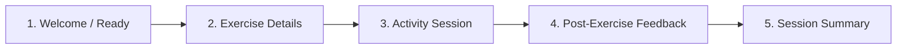

# VELTRIX UI Design System

## 1. Brand Identity

**VELTRIX** is an AI-assisted rehabilitation and care management platform designed for patients recovering from orthopedic and musculoskeletal conditions and the physical therapists guiding their recovery.

### Brand Attributes & Visual Language
- **Clean & Modern:** Uncluttered layouts, generous whitespace, sharp typography, and high visual clarity.
- **Clinical but Friendly:** Clinically accurate and professional, but distinctly warm, encouraging, and human—avoiding cold, intimidating hospital-like aesthetics.
- **Accessible & Trustworthy:** High contrast, legible typography, clear affordances, and predictable interaction patterns that build patient confidence.
- **Health-Tech Precision:** Smooth data visualizations, clear progress metrics, and intuitive rehabilitation workflows.
- **One Unified System:** The **Patient Portal** and **Therapist Portal** are two views of the **same VELTRIX product**, sharing identical design tokens, components, visual hierarchy, and interaction mechanics.

---

## 2. Logo Usage

### Official Logo Policy
- **Brand Name:** VELTRIX
- **Symbol:** Minimal geometric "V" integrated with a dynamic movement / health arc.
- **Policy:** The official VELTRIX logo has been designed and saved by the team. **Do not redesign, regenerate, or replace the logo.**
- **Integration Slot:** The design system reserves standard reusable logo containers across desktop and mobile layouts. When the official logo asset (`/assets/veltrix-logo.svg` / `/assets/veltrix-logo-dark.svg`) is loaded, it seamlessly fits into the designated dimensions.

### Logo Dimensions & Clear Space
| Viewport / Placement | Container Size | Min Clear Space | Theme Behavior |
|---|---|---|---|
| **Desktop Sidebar Header** | `140px × 36px` | `16px` all sides | Swaps to light mark on dark sidebar / dark mark on light sidebar |
| **Mobile Top Bar** | `110px × 28px` | `12px` all sides | Adapts dynamically with theme |
| **Favicon / App Icon** | `32px × 32px` | `4px` all sides | Standalone "V" movement mark |

```
+-------------------------------------------------------------+
| [Clear Space: 16px]                                         |
|   +-----------------------------------------------------+   |
|   |  [ V Symbol ]   V E L T R I X                       |   |
|   +-----------------------------------------------------+   |
| [Clear Space: 16px]                                         |
+-------------------------------------------------------------+
```

---

## 3. Color System

VELTRIX uses a dual-mode semantic token system. Both Light Mode and Dark Mode use the same semantic token names, allowing instant theme switching with zero layout shifts.

### 3.1 Color Palette Specifications

```
  LIGHT MODE PALETTE                         DARK MODE PALETTE
+-------------------------+               +-------------------------+
| Background  #F8FAFC     |               | Background  #0B1120     |
| Surface     #FFFFFF     |               | Surface     #111827     |
| Border      #E2E8F0     |               | Border      #273449     |
| Text Prim   #0F172A     |               | Text Prim   #F8FAFC     |
| Text Sec    #475569     |               | Text Sec    #CBD5E1     |
| Primary     #4F46E5     |               | Primary     #6366F1     |
| Mint Accent #10B981     |               | Mint Accent #10B981     |
+-------------------------+               +-------------------------+
```

### 3.2 Token Mapping Matrix

| Semantic Token | Light Mode Value | Dark Mode Value | Usage / Description |
|---|---|---|---|
| `--color-bg-app` | `#F8FAFC` (Slate 50) | `#0B1120` (Dark Slate 950) | Main app canvas background |
| `--color-surface-card` | `#FFFFFF` (White) | `#111827` (Gray 900) | Primary cards, panels, list rows |
| `--color-surface-elevated`| `#F1F5F9` (Slate 100) | `#172033` (Slate 900) | Modals, drawers, dropdown menus |
| `--color-surface-hover` | `#F8FAFC` | `#1E293B` | Interactive row/card hover state |
| `--color-text-primary` | `#0F172A` (Slate 900) | `#F8FAFC` (Slate 50) | Page titles, card headers, primary data |
| `--color-text-secondary`| `#475569` (Slate 600) | `#CBD5E1` (Slate 300) | Subheadings, labels, secondary metadata |
| `--color-text-muted` | `#94A3B8` (Slate 400) | `#64748B` (Slate 500) | Placeholders, timestamps, disabled text |
| `--color-border-subtle` | `#E2E8F0` (Slate 200) | `#273449` (Slate 800) | Card outlines, dividers, input borders |
| `--color-border-strong` | `#CBD5E1` (Slate 300) | `#334155` (Slate 700) | Active inputs, selected card borders |
| `--color-primary` | `#4F46E5` (Indigo 600) | `#6366F1` (Indigo 500) | Brand primary, action buttons, active tabs |
| `--color-primary-dark` | `#3730A3` (Indigo 800) | `#4F46E5` (Indigo 600) | Primary hover / active press state |
| `--color-primary-subtle`| `#EEF2FF` (Indigo 50) | `#1E1B4B` (Indigo 950) | Selected item background, badge fills |
| `--color-accent-mint` | `#10B981` (Emerald 500)| `#10B981` (Emerald 500)| Streaks, success badges, completion metrics |
| `--color-accent-subtle` | `#ECFDF5` (Emerald 50)| `#064E3B` (Emerald 950)| Completed session background, success tags |
| `--color-status-success`| `#10B981` (Emerald 500)| `#10B981` (Emerald 500)| Positive trends, adherence on-track |
| `--color-status-warning`| `#F59E0B` (Amber 500) | `#FBBF24` (Amber 400) | Moderate pain (4–6), attention needed |
| `--color-status-error` | `#EF4444` (Red 500) | `#F87171` (Red 400) | High pain (7–10), missed sessions, errors |

---

## 4. Typography

VELTRIX uses **Inter** as its primary typeface across all viewports.

### 4.1 Font Family & Fallbacks
```css
font-family: 'Inter', -apple-system, BlinkMacSystemFont, 'Segoe UI', Roboto, Helvetica, Arial, sans-serif;
```

### 4.2 Type Scale & Hierarchy

| Style Level | Font Size | Line Height | Weight | Letter Spacing | Usage |
|---|---|---|---|---|---|
| **Display / Metric** | `32px (2.0rem)` | `40px` | Bold (700) | `-0.02em` | Main streak counters, recovery score % |
| **Heading 1 (H1)** | `24px (1.5rem)` | `32px` | SemiBold (600) | `-0.015em` | Page Titles (e.g. "Today's Exercises") |
| **Heading 2 (H2)** | `20px (1.25rem)`| `28px` | SemiBold (600) | `-0.01em` | Section Titles, Modal Headers |
| **Heading 3 (H3)** | `16px (1.0rem)` | `24px` | SemiBold (600) | `0em` | Card Titles, Exercise Names |
| **Subheading** | `14px (0.875rem)`| `20px` | Medium (500) | `0em` | Card Subtitles, Clinical Categories |
| **Body Regular** | `14px (0.875rem)`| `20px` | Regular (400) | `0em` | Standard descriptions, instructions |
| **Body Small** | `12px (0.75rem)` | `16px` | Regular (400) | `+0.01em` | Metadata, timestamps, helper text |
| **Caption / Label** | `11px (0.6875rem)`| `14px` | SemiBold (600) | `+0.04em` | Status Badges, Metric labels (UPPERCASE) |
| **Button Text** | `14px (0.875rem)`| `20px` | SemiBold (600) | `+0.01em` | Button and interactive tab labels |

---

## 5. Buttons

All buttons adhere to an **8px border radius** (`rounded-lg`) and maintain touch-friendly target sizes (min `40px` height on desktop, `44px` on mobile).

### 5.1 Button Variants

```
+-------------------+   +-------------------+   +-------------------+   +-------------------+
|  Primary Button   |   | Secondary Button  |   |  Outline Button   |   |  Success Button   |
|   [#4F46E5 Solid] |   |   [Surface White] |   | [Transparent+Bdr] |   |   [#10B981 Mint]  |
+-------------------+   +-------------------+   +-------------------+   +-------------------+
```

1. **Primary Button:**
   - *Light Mode:* Background `#4F46E5`, Text `#FFFFFF`, Hover `#3730A3`, Active `#312E81`.
   - *Dark Mode:* Background `#6366F1`, Text `#FFFFFF`, Hover `#4F46E5`, Active `#4338CA`.
   - *Usage:* Primary calls to action (`"Start"`, `"Continue"`, `"Prescribe & Assign"`, `"Save Changes"`).
2. **Secondary Button:**
   - *Light Mode:* Background `#FFFFFF`, Border `#E2E8F0`, Text `#0F172A`, Hover `#F8FAFC`.
   - *Dark Mode:* Background `#172033`, Border `#273449`, Text `#F8FAFC`, Hover `#1E293B`.
   - *Usage:* Supporting actions (`"View All"`, `"Cancel"`, `"View My Progress"`, `"Save as Draft"`).
3. **Outline Button:**
   - *Light Mode:* Background `transparent`, Border `1.5px solid #4F46E5`, Text `#4F46E5`, Hover `#EEF2FF`.
   - *Dark Mode:* Background `transparent`, Border `1.5px solid #6366F1`, Text `#6366F1`, Hover `#1E1B4B`.
   - *Usage:* Secondary clinical actions (`"View Details"`, `"Filter by Joint"`).
4. **Success Button:**
   - *Both Modes:* Background `#10B981`, Text `#FFFFFF`, Hover `#059669`, Active `#047857`.
   - *Usage:* Positive completions (`"Finish Workout"`, `"Mark Reviewed"`, `"Complete Session"`).

### 5.2 Interactive States
- **Focus State:** `2px solid var(--color-primary)` with `2px` offset (`focus-visible:ring-2`).
- **Disabled State:** Opacity `50%`, cursor `not-allowed`, pointer-events `none`.
- **Loading State:** Text hidden or shifted, centered spinner icon matching text color.

---

## 6. Card System

Cards are the primary content container across both Patient and Therapist screens.

```
+-------------------------------------------------------------+
| Card Header (H3 Title + Status Badge)       Radius: 12px    |
| Border: 1px solid var(--color-border-subtle)                |
| Elevation: 0 1px 3px 0 rgba(0, 0, 0, 0.05)                 |
|-------------------------------------------------------------|
| Card Body Content (Metrics, Media, Descriptions, Graphs)    |
| Padding: 16px or 24px (8px Spacing Grid)                    |
|-------------------------------------------------------------|
| Card Footer Action Bar (Buttons, Links)                     |
+-------------------------------------------------------------+
```

### 6.1 Card Specifications
- **Border Radius:** `12px` (`rounded-xl`).
- **Border:** `1px solid var(--color-border-subtle)`.
- **Background:**
  - *Light Mode:* `#FFFFFF` on `#F8FAFC` background.
  - *Dark Mode:* `#111827` on `#0B1120` background.
- **Elevated Surfaces:** Modals, popovers, and sticky headers use `#172033` (Dark) / `#FFFFFF` (Light) with elevation shadow `0 10px 15px -3px rgba(0, 0, 0, 0.1)`.
- **Padding Options:**
  - *Compact Card:* `12px` (Mobile list items, summary pills).
  - *Standard Card:* `16px` / `20px` (Exercise cards, metric widgets).
  - *Spacious Card:* `24px` (Clinical detail containers, onboarding forms).

### 6.2 Supported Card Patterns
- **Exercise Card:** Poster/icon, exercise title, sets/reps/hold metrics, status tag (`Pending` / `In Progress` / `Completed`), action button (`Start` / `Continue`).
- **Dashboard Stat Metric Card:** Metric icon, numeric display (e.g. `14 Days` Streak), label, mini trendline badge.
- **Session Telemetry Card:** Rep-by-rep table, AI form score %, joint ROM angle graph.
- **Therapist Note Card:** Clinician avatar/badge, timestamp, note category tag, clinical note body.

---

## 7. Spacing System

VELTRIX strictly enforces an **8px base grid** for paddings, margins, gaps, and structural heights.

```
4px    [Micro space / badge padding]
8px    [Base space / element gap]
16px   [Standard padding / card internal margins]
24px   [Section gap / card group spacing]
32px   [Large block separation / hero padding]
40px   [Major layout margin]
48px   [Screen header margin]
64px   [Page container top/bottom bounds]
```

### Spacing Scale Matrix
| Token | Pixel Value | Rem Value | Preferred Usage |
|---|---|---|---|
| `space-1` | `4px` | `0.25rem` | Icon-to-text gap, badge vertical padding |
| `space-2` | `8px` | `0.5rem` | Form field gap, button internal spacing |
| `space-3` | `12px` | `0.75rem` | Compact card padding, dropdown item padding |
| `space-4` | `16px` | `1.0rem` | Standard card padding, grid gutter |
| `space-6` | `24px` | `1.5rem` | Card-to-card gap, section inner padding |
| `space-8` | `32px` | `2.0rem` | Major dashboard widget separation |
| `space-12`| `48px` | `3.0rem` | Screen header bottom spacing |
| `space-16`| `64px` | `4.0rem` | Desktop page boundary padding |

---

## 8. Navigation

The navigation architecture is responsive, adapting between desktop and mobile while keeping identical destinations, terminology, and status tracking.

```
DESKTOP (Left Sidebar - 260px)                 MOBILE (Bottom Nav - Fixed)
+--------------------------------+           +-----------------------------+
| [VELTRIX Logo]                 |           | Screen Content              |
|                                |           |                             |
|  * Dashboard                   |           |                             |
|  * Exercises                   |           |                             |
|  * Progress                    |           +-----------------------------+
|  * Messages                    |           | [*]   [*]   [*]   [*]   [*] |
|                                |           | Home  Exer  Prog  Msg   Prof|
| [Theme Toggle] [User Profile]  |           +-----------------------------+
+--------------------------------+
```

### 8.1 Desktop: Left Sidebar Navigation
- **Width:** `260px` fixed, full viewport height.
- **Top Section:** Official VELTRIX logo container (`16px` padding) + role indicator badge (`Patient Portal` or `Clinician Portal`).
- **Nav Links:** Vertical item stack with `8px` gap:
  - Icon (`20px × 20px`) + Label (`14px SemiBold`).
  - *Active State:* Solid Primary background (`#4F46E5` / `#6366F1`), White text, subtle glow.
  - *Inactive State:* Secondary text (`var(--color-text-secondary)`), transparent background, hover `#F1F5F9` / `#1E293B`.
- **Bottom Section:** Theme Mode Switcher (`Light` / `Dark` toggle), Notifications bell with unread counter, and User Profile avatar + name.

### 8.2 Mobile: Bottom Navigation Bar
- **Height:** `64px` (+ safe area inset for iOS/Android).
- **Placement:** Fixed bottom, `z-index: 50`, backdrop blur with `var(--color-surface-card)`.
- **Tabs (4–5 items):** `Home / Dashboard`, `Exercises`, `Progress`, `Messages`, `Profile`.
- **Touch Target:** `48px × 48px` minimum touch bounding box per tab.
- **Top Bar (Mobile):** Slim header (`56px`) with compact VELTRIX logo, theme toggle icon, and notification bell.

---

## 9. Patient UI Patterns

The Patient UI provides an encouraging, goal-oriented experience that promotes routine adherence and clear exercise execution.

### 9.1 Patient Dashboard Structure
- **Header:** Personalized greeting (*"Welcome back, Alex"*) + Day/Date + Current Care Phase (*"Week 3: Knee ROM Protocol"*).
- **Core KPI Metric Strip (4 Cards):**
  1. `"Today's Progress"` — Donut or linear progress bar (e.g. `2 of 3 Completed`).
  2. `"Streak"` — Flame icon with active day counter (e.g. `5 Days Streak`).
  3. `"This Week"` — Weekly adherence bar indicator (e.g. `92% Adherence`).
  4. `"Total Minutes"` — Active rehabilitation time (e.g. `45 Mins`).
- **"Today's Exercises" Section:**
  - Header with `"View All"` action link.
  - Stack of Exercise Cards displaying:
    - Exercise illustration/icon placeholder.
    - Title (e.g., `"Pendulum Stretch"`, `"Wall Slides"`, `"Shoulder External Rotation"`).
    - Dosage summary (e.g., `3 Sets × 10 Reps • 5s Hold`).
    - Status Badge: `Pending` (Neutral), `In Progress` (Indigo), `Completed` (Mint).
    - Contextual Action Button: `"Start"` (Primary), `"Continue"` (Primary), `"Review"` (Secondary).
- **Supporting Information Cards:**
  - `"Therapy Tip"`: Highlight card with guidance (e.g., *"Keep movements smooth and avoid pushing into sharp pain."*).
  - `"Next Session"`: Schedule indicator with countdown/time.
  - `"View My Progress"`: Direct shortcut to recovery trajectory graphs.

### 9.2 Patient Exercise Flow (5-Step Sequence)



1. **Patient Login / Welcome:** Clean authentication establishing patient session.
2. **Exercise Details Screen:**
   - High-definition motion demonstration video / animation loop.
   - Structured guidance pills: `Setup`, `Motion`, `Relax`.
   - Clear step-by-step instructions and key form checkpoints.
   - Primary action: `"Start Exercise"` button.
3. **Activity Session Screen (Live Workout):**
   - Clean, distraction-free execution canvas.
   - Real-time rep counter & hold countdown timer.
   - Session progress bar (`Rep 4 of 10 • Set 2 of 3`).
   - Controls: `"Pause"` and `"Finish Workout"` buttons.
4. **Post-Exercise Feedback Screen:**
   - Subjective Pain Rating Slider (VAS 0–10 scale: Mild 1–3, Moderate 4–6, Severe 7–10).
   - Energy Level rating (1–5 icons).
   - Patient notes/comments textarea (*"How did this set feel?"*).
   - Primary action: `"Save & View Summary"`.
5. **Session Summary Screen:**
   - Celebratory completion badge.
   - Metrics summary: Total minutes completed, exercises done, streak updated.
   - Primary action: `"View My Progress"` or `"Return to Dashboard"`.

---

## 10. Therapist UI Patterns

The Therapist UI uses the **exact same design system** (colors, cards, typography, buttons, spacing, and navigation) while tailoring views for clinical caseload oversight.

### 10.1 Therapist Dashboard
- **Caseload Summary Strip:** Total Active Patients, Average Compliance Rate (%), High-Risk Pain Alerts count, Sessions Completed Today.
- **High-Priority Clinical Alerts:** Highlight cards for patients reporting pain > 6/10 or missed consecutive routines.
- **Recent Completed Sessions Feed:** Real-time stream of patient workouts with AI pose accuracy % and pain scores.
- **Quick Action Bar:** `+ Create Exercise`, `+ Prescribe Regimen`, `+ Invite Patient`.

### 10.2 Patient List & Directory
- Filterable by Joint Area (`Knee`, `Shoulder`, `Spine`, `Ankle`, `Hip`), Status (`Active`, `On Hold`, `Discharged`), and Adherence Risk.
- Data table / Card grid with patient avatars, diagnosis, active protocol phase, adherence progress bar, and last active timestamp.

### 10.3 Patient Progress & Session Details
- **Range of Motion (ROM) Progress Curve:** Interactive chart plotting joint angle degrees over time against healthy benchmarks.
- **Session Telemetry Inspector:** Rep-by-rep AI pose angles, compensation deviation badges (e.g. *"Trunk lean detected"*), and AI automated feedback.
- **Pain History Log:** VAS pain score trendlines correlated with exercise intensity.
- **Therapist Clinical Notes:** Chronological notes timeline with structured note tagging (`Plan Modification`, `General Progress`, `Assessment`).

### 10.4 Exercise Management Library (Independent CRUD)
- Catalog grid of standard platform exercises and clinic-custom exercises.
- Action controls to **Create**, **View**, **Edit**, and **Archive** exercises independently from patient assignment.

---

## 11. Light Mode Specification

Light Mode is calibrated for high daylight readability, clinical clarity, and a welcoming feel.

```css
/* Light Mode Design Tokens */
:root, [data-theme="light"] {
  --color-bg-app: #F8FAFC;
  --color-surface-card: #FFFFFF;
  --color-surface-elevated: #F1F5F9;
  --color-surface-hover: #F8FAFC;
  
  --color-text-primary: #0F172A;
  --color-text-secondary: #475569;
  --color-text-muted: #94A3B8;
  
  --color-border-subtle: #E2E8F0;
  --color-border-strong: #CBD5E1;
  
  --color-primary: #4F46E5;
  --color-primary-dark: #3730A3;
  --color-primary-subtle: #EEF2FF;
  
  --color-accent-mint: #10B981;
  --color-accent-subtle: #ECFDF5;
  
  --color-status-success: #10B981;
  --color-status-warning: #F59E0B;
  --color-status-error: #EF4444;
  
  --shadow-sm: 0 1px 2px 0 rgba(0, 0, 0, 0.05);
  --shadow-md: 0 4px 6px -1px rgba(0, 0, 0, 0.07), 0 2px 4px -2px rgba(0, 0, 0, 0.05);
  --shadow-lg: 0 10px 15px -3px rgba(0, 0, 0, 0.08), 0 4px 6px -4px rgba(0, 0, 0, 0.03);
}
```

---

## 12. Dark Mode Specification

Dark Mode provides a true, comfortable dark interface that reduces eye strain while maintaining identical layouts, component sizes, and hierarchy.

```css
/* Dark Mode Design Tokens */
[data-theme="dark"] {
  --color-bg-app: #0B1120;
  --color-surface-card: #111827;
  --color-surface-elevated: #172033;
  --color-surface-hover: #1E293B;
  
  --color-text-primary: #F8FAFC;
  --color-text-secondary: #CBD5E1;
  --color-text-muted: #64748B;
  
  --color-border-subtle: #273449;
  --color-border-strong: #334155;
  
  --color-primary: #6366F1;
  --color-primary-dark: #4F46E5;
  --color-primary-subtle: #1E1B4B;
  
  --color-accent-mint: #10B981;
  --color-accent-subtle: #064E3B;
  
  --color-status-success: #10B981;
  --color-status-warning: #FBBF24;
  --color-status-error: #F87171;
  
  --shadow-sm: 0 1px 2px 0 rgba(0, 0, 0, 0.3);
  --shadow-md: 0 4px 6px -1px rgba(0, 0, 0, 0.4), 0 2px 4px -2px rgba(0, 0, 0, 0.2);
  --shadow-lg: 0 10px 15px -3px rgba(0, 0, 0, 0.5), 0 4px 6px -4px rgba(0, 0, 0, 0.3);
}
```

### Theme Consistency Rules
- **No Layout Shift:** Card heights, padding, font weights, and border widths remain identical between themes.
- **Contrast Integrity:** Text contrast meets minimum `4.5:1` against cards in both modes.
- **Subtle Borders:** Dark mode surfaces rely on `#273449` borders to establish clean edge definition without muddy shadows.

---

## 13. Accessibility Requirements

1. **Contrast Standards:**
   - All body text and headings achieve WCAG 2.1 AA compliance (minimum `4.5:1` contrast ratio).
   - Large text (≥ 24px) and essential UI controls achieve minimum `3:1` contrast ratio.
2. **Accessible Focus States:**
   - Every interactive element (buttons, tabs, inputs, cards) exhibits a high-contrast focus outline: `2px solid var(--color-primary)` with `2px` offset.
3. **Multi-Modal Status Indicators:**
   - Statuses (e.g. `Pending`, `In Progress`, `Completed`, `Pain Alerts`) never rely solely on color. They must always pair color with clear text labels and distinct icons.
4. **Touch Targets:**
   - All interactive controls on mobile and tablet maintain a minimum bounding box of `44px × 44px`.
5. **Form Field Accessibility:**
   - All inputs feature visible permanent labels, programmatic `aria-describedby` error text, and explicit focus rings.

---

## 14. Design Principles Summary

| Principle | Core Directive |
|---|---|
| **Clean** | Eliminate unnecessary visual noise; let patient recovery metrics and clinical data take center stage. |
| **Clinical but Friendly** | Deliver medical-grade clarity with approachable, warm tones and motivational feedback. |
| **Modern** | Utilize clean Inter typography, subtle elevations, 8px/12px radii, and crisp dual-theme palettes. |
| **Accessible** | Maintain strict WCAG AA contrast, clear focus states, legible type scales, and touch-ready targets. |
| **Trustworthy** | Ensure consistent visual language, predictable flows, and accurate real-time telemetry representation. |
| **Consistent** | Person 1 (Patient) and Person 2 (Therapist) share the exact same component library, design tokens, and branding. |
